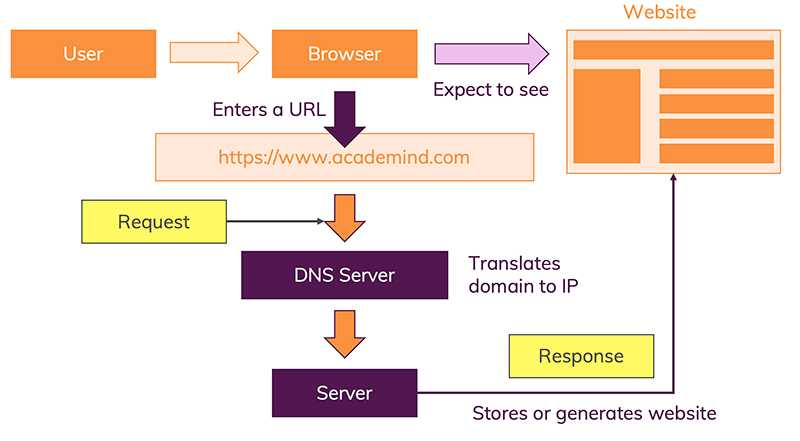
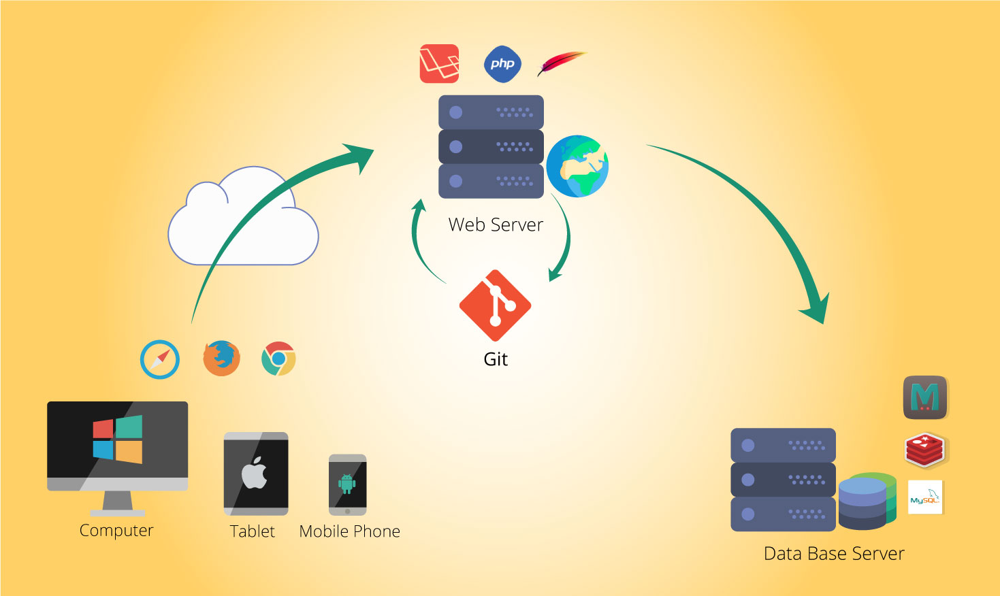

### Overview

Gets you started with foundations of Web development and walks you through various components involved and how it is developed. Gives an idea of major roles involved in developing this magical world of Web.

### Learning Outcomes
- How does the Web work?

- What are the systems involved in Web?

- How is Web developed?

- What are the major roles in Web development?

### Introduction
- How Websites Work
	- The moment you enter this address in your browser and you hit ENTER, a lot of different things happen
		- The URL gets resolved
		- A Request is sent to the server of the website
		- The response of the server is parsed
		- The page is rendered and displayed

- Systems involved in Web
	- Client - is typically a web browser or mobile application. This would more specifically be an HTTP client. This would be implemented with languages like HTML, CSS, JavaScript or mobile application languages.
	- Server - is a central application that talks with many clients. It is analogous to a waiter in a restaurant that serves many customers. It processes their requests as quickly as possible. When people say “server” without anymore context, they’re mostly referring to a web server or HTTP server. There are other kinds such as “database servers” which use proprietary communication protocols instead of HTTP to talk with their clients. For example, Microsoft SQL Server, Oracle Database Server, MySQL Server are database servers.
	- Database - is where data is stored. A database management system is software that facilitates communication with a database. Nearly all database management systems use a client-server pattern like is involved with HTTP. A web server that uses a database would connect as a database client to the database server to read and write data. There are many kinds of database management systems. SQL are the most popular but NoSQL(non-SQL) such as MongoDb are becoming more popular. A very simple database can be maintained directly on the file system and not require any client-server pattern.

- Major roles involved in Web development

### What you must do
- Understand [how the Web works](https://www.academind.com/learn/web-dev/how-the-web-works/)
- Understand the [basics of Web developement](https://medium.com/@ronneldavis/introduction-to-web-development-7d8b913ee2c8)
- Understand [what a Web developer does](https://www.youtube.com/watch?v=GEfuOMzRgXo)
- Understand [major roles involved in Web development](https://www.youtube.com/watch?v=i5qpS_D8Law)

### Additional Resources
- Further [understand how the web works](https://www.explainthatstuff.com/howthewebworks.html)
