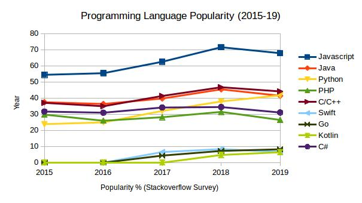

### Overview

This section emphasises on significance of backend in Web and the components involved in the same. You will also learn about backend languages that are talk of the web development town and get an insight into core responsibilities of a backend developer.

### Learning Outcomes
- What is backend in Web development?

- What is the significance of backend in Web?

- What are the components involved in backend?

- Which are the most popular backend technologies?

- What are core responsibilities of a backend developer?

### Introduction
- Back-end developers work with front-end developers by giving the outward facing web app elements of server-side logic. In other words, back-end dev’s create the business logic to make the web app work correctly, and they achieve this through the use of back end scripting languages. Some of the regular responsibilities include
	- Writing server-side code
	- Interacting with database
	- Writing code to communicate with the database
	- Deploying the system online so the app can be usable
	- Maintaining security of the code
	- Maintaining code to be optimised to handle large traffic volume
	- Integrating server-side logic with front end
	- Design and implementation of data storage solutions
	- Building reusable code and libraries for future use
	- Writing documentation for ease of use for new developers
- Back-end developers usually work in groups or teams. Within larger organisations, there can be both back-end and front-end engineers, which can include - engineers with specific roles like REST API developers or quality assurance or architects.

### What you must do
- Understand the [basics of backend development](https://codeburst.io/getting-started-with-backend-development-bfd8299e22e8)
- Understand the [components involved in backend development](https://www.youtube.com/watch?v=0Kv_k4ypj6o)
- Understand [core responsibilities of a backend developer](https://www.careerexplorer.com/careers/back-end-developer/)

### Additional Resources
- Take a look at [what a backend developer does at Booking.com](https://careers.booking.com/job/BOOKUS2000901EXTERNAL/Senior-Backend-Developer-Payments)
- Take a look at [what a backend developer does at Uber](https://www.uber.com/global/en/careers/list/41602/)
