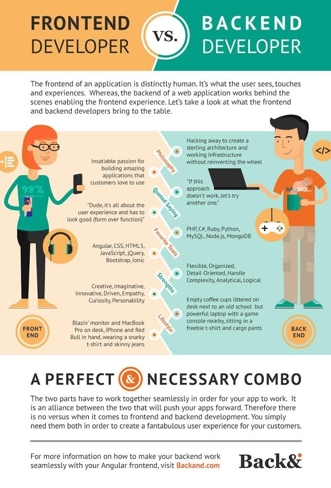

### Overview

This section gives you a sneak peek into daily life of a backend developer at work. You get to understand what are the routine tasks for a backend developer and how he manages to get the magic done in real life.

### Learning Outcomes
- What are the major tasks involved in life of a backend developer?

- How does a day in life of a backend developer look like?

### Introduction
- Major focus areas during the day of a developer
	- Maintain legacy applications - Coming into this position, I inherited several (about 20) different PHP applications, all created at different points in time. Fortunately they all happen to be in Zend, so at least there was some consistency. This part of the job is probably the most time consuming, since we maintain so many webapps. Additionally, most of these applications leverage several different technologies, so PHP alone makes up possibly 60% of the codebase, with the rest being some form of SQL, javascript, CSS, etc.
	- Put out fires - This is where a diverse skill set can really help you in the long run. Anything from doing queries against a database (we typically use MySQL, but there is some Oracle floating around), touching an application you’ve never seen before because something broke (some of our applications haven’t been updated in years, but continue to be in production…), to putting on your devops hat and figuring out why one application is still trying to use a deprecated form of authentication (in our case WRAP) when the htaccess rules are supposed to be leaning it in a different direction (SHIB).
	- Offer technical advice - Experience gives you hindsight, and there’s no better way to solidify that knowledge than by sharing it with others. We work in tandem with another, more design-oriented WordPress group. They do development as well, but not nearly as heavily. So from time to time, I’ll walk down the hall and help with debugging a PHP error, or give guidance on how to work with a particular API, or in some cases I may even be working with them directly on a project. Usually my guidance takes the form of figuring out what Git did (read: what the user did wrong in Git) and how to fix it.
	- Collaborate - My co-worker handles our mobile development, but he also maintains some web-based applications, so occasionally we will work together to solve a problem. Since our group is gearing more toward app development on Google Cloud Platform (or more specifically Google App Engine), we are usually having to use the same tools to accomplish different things, so it helps to be able to brainstorm and share ideas.
	- Teaching - Yet another facet of the daily routine is offering guidance and teaching the interns who work in our office. Since it’s a university, we usually get students that are working toward some sort of computer science degree, but not always. In some ways, it can be frustrating working with someone who not only asks lots of questions about how to do something, but also asks more questions about why it’s done a specific way. But in another light, this can be a great tool, since fresh eyes are an important part of any development process.

### What you must do
- Have a look at [day in the life of a software developer](https://codeinstitute.net/blog/a-day-in-the-life-of-a-software-developer/)
- Understand [major focus areas that a backend developer is daily involed in](https://www.quora.com/What-things-does-a-backend-web-developer-do-every-day-at-work)

### Additional Resources
- Further you can look into [few threads](https://www.reddit.com/r/webdev/comments/47ozta/backend_developers_what_does_your_work_life/) to understand the day in life of a backend developer
