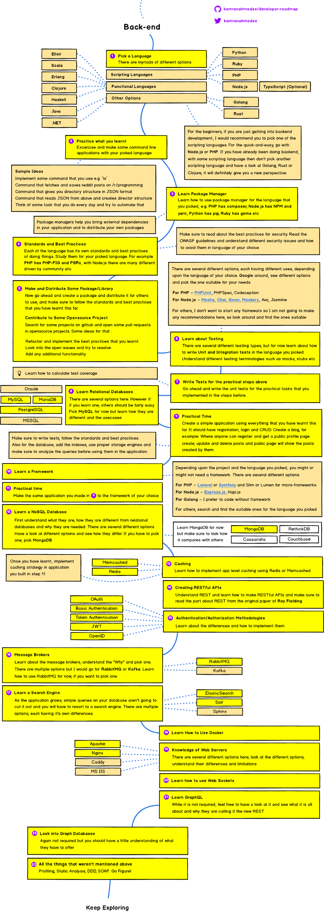

### Overview

Gives you a pathway into learning backend development and introduces you with core focus areas for the getting started. Also you will get a systematic roadmap on how to approach learning common concepts and technologies to master all that is there in backend development.

### Learning Outcomes
- What are major focus areas for one to become a backend developer?

- What are the major concepts to be learnt in backend?

- What are the major technologies to learn?

### Introduction
- Overalls of roadmap for a backend developer
	- Learning language
		- Interpreted
		- Compiled
	- Learning a package manager
	- Learning best adopted standards & practices
	- Publishing a library/package
	- Learning few testing methodolgies
	- Learning databases
		- SQL
		- NoSQL
	- Learning some framework for the technoogy used
	- Learn commonly used caching methodologies
	- Learn how to design and build APIs
	- Learn queueing technologies and understanding when to use which
	- Learns basics of containerization
	- Learn continuous integration & deployment

### What you must do
- Learn about [things to focus on to become a backend developer](https://medium.com/tech-tajawal/modern-backend-developer-in-2018-6b3f7b5f8b9)
- Have a look at the [roadmap that every backend developer should follow](https://medium.com/level-up-web/developer-roadmaps-all-in-one-place-75c0402db0e0)
- Get started with [backend development](https://codeburst.io/getting-started-with-backend-development-bfd8299e22e8)
- Have a look at another [guide to backend development](https://medium.com/devtrailsio/beginners-web-development-guide-part-2-backend-fd466212dbfc)

### Additional Resources
- Further take a look at another take on [how to become a backend developer](https://www.youtube.com/watch?v=xXpwMzyhBqI&t=339s)
