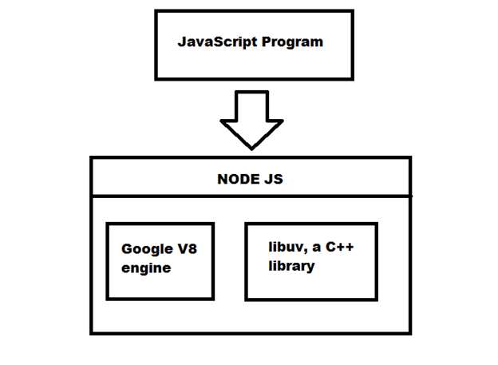

### Overview

There is no way there can be a profound discussion on Node.Js without involving Javascript in it. This section introduces you to Javascript and gives you an insight into how it is related to Node.Js.

### Learning Outcomes
- What is Javascript?

- How is Node.Js related to Javascript?

### Introduction
- Javascript is an implementation of ECMAScript, a standard defining the programming language.
- Browsers have a built-in interpreter for Javascript, along with a bunch of libraries and a run-time environment for working with web pages.
- Node.Js is an interpreter and environment for javascript which includes a bunch of libraries for using javascript as a general-purpose programming language, with an emphasis on asynchronicity and non-blocking operations. Node actually runs the same interpreter as Google Chrome (V8), but provides a different set of libraries and a different run-time environment. It also includes a package management system (NPM) and a few language extensions you won't find standard in browsers (for example modules).
- So the JS interpreter in Google Chrome and the JS interpreter in Node.Js are essentially the same. The difference is, in a browser your end goal is to modify stuff in a web page (text, graphics, stylesheets, etc), in Node.Js it's to run general purpose code that might do anything from running a web server to manipulating files.

### What you must do
- Understand [what is Javascript](https://www.bitdegree.org/tutorials/what-is-javascript-used-for/)
- Understand [where Javascript is used](https://www.youtube.com/watch?v=dlfrWbYk1v0)
- Unerstand [how Javascript and Node.Js are related](https://www.educba.com/javascript-vs-node-js/)

### Additional Resources
- Further check a few answers on this [thread](https://www.quora.com/What-is-the-difference-between-JavaScript-and-Node-js) so as to know the connection between Javascrip & Node.Js
