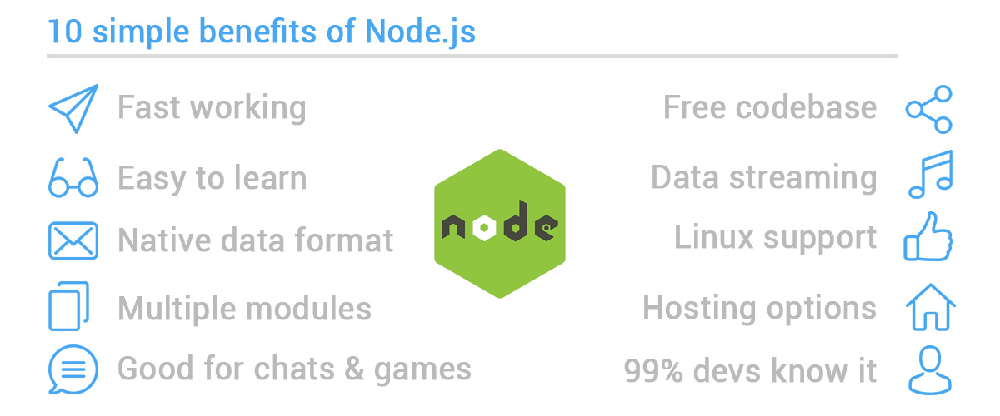
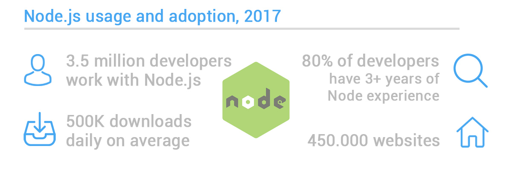

### Overview

This section gives you a detailed view into use-cases and benefits of Node.Js. You will learn why Node.Js has gained popularity over other similar languages in backend ecosystem and reasons for it to be perpetually trending.

### Learning Outcomes
- What are use-cases for Node.Js?

- What are benefits of using Node.Js?

- How it is better than other langugaes before and in its time?

- Reasons for Node.Js to trend?

### Introduction
- Reasons for Node.Js to be so hugely adopted
	- Good for beginner developers, JavaScript is simple to learn, rich framework (Angular, Node, Backbone, Ember)
	- It is fast, due to Google innovative technologies and the event loop
	- Ability to keep data in native JSON (object notation) format in your database
	- Multiple modules (NPM, Grunt, etc.) and supportive community
	- Good to create real-time apps, such as chats and games
	- Single free codebase
	- Good for data streaming, thus for audio and video files, as example
	- Sponsored by Linux Foundation, as well as PayPal, Joylent, Microsoft, Walmart
	- Wide range of hosting options
	- JS is the longest running language, 99% of developers know some of it

### What you must do
- Understand [major use-cases for Node.Js](https://thinkmobiles.com/blog/why-use-nodejs/)
- Understand [benefits & reasons for it to trend](https://www.monterail.com/blog/nodejs-developers-in-demand)
- Understand [complelling reasons for using Node.Js and what sets it apart](https://medium.com/the-node-js-collection/why-the-hell-would-you-use-node-js-4b053b94ab8e)
- Take a look at [detailed statistics and where Node.Js adoption stands](https://insights.stackoverflow.com/survey/2019) as far as these are concerned

### Additional Resources
- Further find out more [compelling reasons for using Node.Js](https://www.youtube.com/watch?v=BKorQQO4xtM&t=104s)
