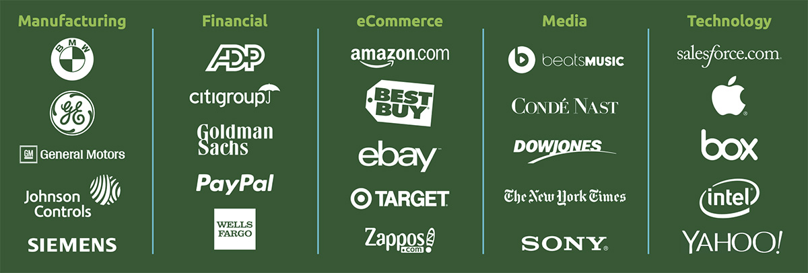

### Overview

It would not be an exaggeration to say that Node.Js in the past decade has taken world of backend development by a storm. You will get to learn why Node.Js has proven to be a viable option for current day organisations. This section introduces you to all the popular products that we use each day and have been developed in Node.Js.

### Learning Outcomes
- Why is it such a popular option to most current day organisations?

- Which popular products are using Node.Js?

### Introduction
- Few top products using Node.Js in production
	- Netflix
	- Linkedin
	- Walmart
	- Trello
	- Uber
	- PayPal
	- Medium
	- eBay
	- NASA
	- Groupon

### What you must do
- Understand [how organisations benefit from Node.Js](https://blog.risingstack.com/how-enterprises-benefit-from-nodejs/)
- Take a look at more [benefits that Node.Js provides](https://neoteric.eu/blog/who-can-benefit-from-node-js/)
- Take a look at [popular products using Node.Js in production](https://softwarebrothers.co/blog/companies-that-use-node-js/)

### Additional resorces
- Find out more [companies](https://www.tothenew.com/blog/how-are-10-global-companies-using-node-js-in-production/) using it
- And [a few more](https://www.netguru.com/blog/top-companies-used-nodejs-production)
