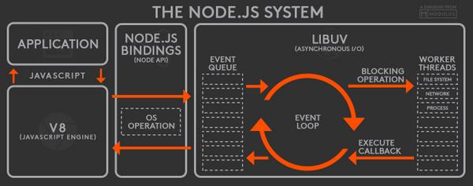
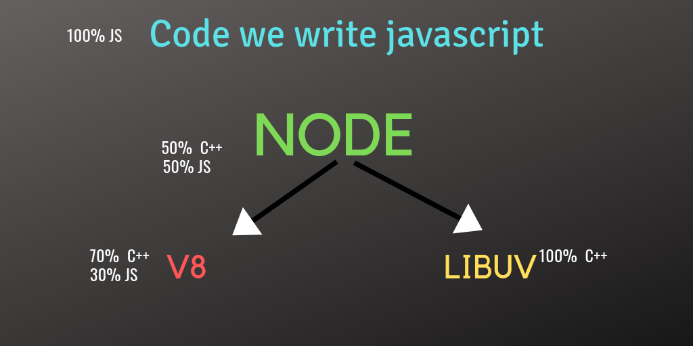

### Overview

This section explores the internals of Node.js ecosystem. This includes a brief introduction to internal core components that power Node.Js. Also you will get an understanding of how the language can scale so well with its single threaded architecture.

### Learning Outcomes
- What is V8 engine?

- What is LibUV?

- What is Main thread, event queue and event loop in Node.Js ecosystem?

- What is the overall architecture of Node.Js?

- How Node.Js scales so well for web traffic with just a single thread?

### Introduction
- Internals of Node.Js
	- V8 - Google's open source JavaScript engine that resides in Chrome/Chromium browsers. Instead of interpreting JavaScript code on the fly like typical web browsers do, V8 translates your JS code into machine code so that it's blazing fast. V8 is written in C++. Read more about how V8 works here.

	- LibUV - libuv is originally developed to provide asynchronous I/O that includes asynchronous TCP & UDP sockets, (famous) event loop, asynchronous DNS resolution, file system read/write, and etc. libuv is written in C. Here is a good video to check out to learn more about libuv.
	Other Low-Level Components - such as c-ares, http parser, OpenSSL, zlib, and etc, mostly written in C/C++.

	- Application - here is your code, modules, and Node.js' built in modules, written in JavaScript (or compiled to JS through TypeScript, CoffeeScript, etc.)
	Binding - a binding basically is a wrapper around a library written in one language and expose the library to codes written in another language so that codes written in different languages can communicate.

### What you must do
- Understand the [internals of Node.Js](https://medium.com/front-end-weekly/internals-of-node-advance-node-%EF%B8%8F-8612f6a957d7)
- Understand the [architecture of Node.Js](https://www.oodlestechnologies.com/blogs/Internal-Architecture-Of-NodeJS/)
- Understand overview of [how Node.Js works](https://www.youtube.com/watch?v=jOupHNvDIq8)
- Understand [what is Event loop](https://medium.com/the-node-js-collection/what-you-should-know-to-really-understand-the-node-js-event-loop-and-its-metrics-c4907b19da4c)
- Understand [detailed functioning of Event loop](https://www.youtube.com/watch?v=8aGhZQkoFbQ)
- Understand underlying [architecture powering Node.Js](https://www.youtube.com/watch?v=XUSHH0E-7zk)
- Understand [how Node.Js scales](https://medium.com/better-programming/is-node-js-really-single-threaded-7ea59bcc8d64) with just a single thread

### Additional Resources
- Further understand [how Node.Js scales with power of Event loop](https://www.youtube.com/watch?v=zphcsoSJMvM)
- Further [dive deeper](https://www.youtube.com/watch?v=LbwUETu7Rgc) into the internals of Node.Js
- Further [revise](https://www.freecodecamp.org/news/what-exactly-is-node-js-ae36e97449f5/) the architecture of Node.Js
