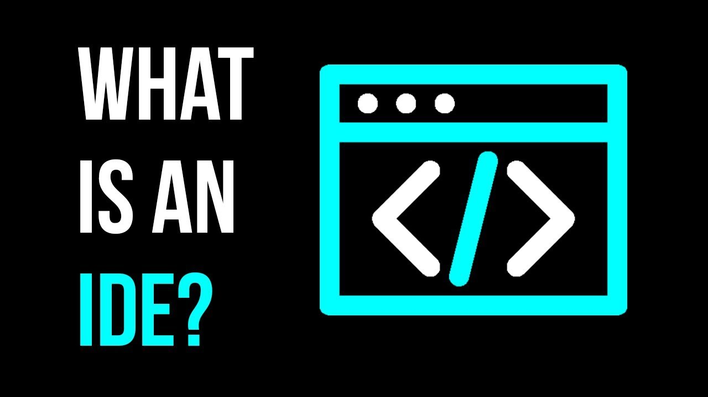

### Overview

Gives you an understanding of what an IDE is and the popular ones out there in the market. Also walks you through the installation of this software and helps you customize the same.

### Learning Outcomes
- What is an IDE and which are the most used IDEs?

- How to install an IDE?

- How to customize the IDE?

### Introduction
- What is an IDE?
	- An IDE, or Integrated Development Environment, enables programmers to consolidate the different aspects of writing a computer program.
	- IDEs increase programmer productivity by combining common activities of writing software into a single application: editing source code, building executables, and debugging.
		- EDITING SOURCE CODE
			- Writing code is an important part of programming. We start with a blank file, write a few lines of code, and a program is born! IDEs facilitate this process with features like syntax highlighting and autocomplete.

		- SYNTAX HIGHLIGHTING
			- An IDE that knows the syntax of your language can provide visual cues. Keywords, words that have special meaning like class in Java, are highlighted with different colors.
			- Syntax highlighting makes code easier to read by visually clarifying different elements of language syntax.

		- AUTOCOMPLETE
			- When the IDE knows your programming language, it can anticipate what you’re going to type next!
			- We’ve seen statements with System.out.println() quite a bit so far. In an IDE, we might see System as an autocomplete option after only typing Sy. This saves keystrokes so the programmer can focus on logic in their code.
			- Autocompleting a command

		- BUILDING EXECUTABLES
			- Java is a compiled language. Before programs run, the source code of a .java file must be transformed into an executable .class by the compiler. Once compiled, the program can be run from the terminal.
			- This compilation process is necessary for every program, so why not have the IDE do it for us? IDEs provide automated build processes for languages, so the act of compiling and executing code is abstracted away.

		- DEBUGGING
			- No programmer avoids writing bugs and programs with errors.
			- When a program does not run correctly, IDEs provide debugging tools that allow programmers to examine different variables and inspect their code in a deliberate way.
			- IDEs also provide hints while coding to prevent errors before compilation.
			- Catching a bug

		- CODING ON YOUR COMPUTER
			- The biggest benefit to using an IDE is that it allows you to code and run Java programs on your own computer. We recommend IntelliJ IDEA, which you can download for macOS, Windows, or Linux.

### What you must do
- Understand [what is an IDE](https://www.redhat.com/en/topics/middleware/what-is-ide)
- Take a look at [popular IDEs for Node.Js development](https://www.credencys.com/blog/ides-for-nodejs-app-development/)
- Understand [how to install Visualstudio Code](https://code.visualstudio.com/docs/setup/windows) on your machine
- Understand [how to customize your IDE](https://code.visualstudio.com/docs/nodejs/working-with-javascript) to work well with Node.Js
- Take a look at [popular extensions for Visualstudio Code](https://developer.okta.com/blog/2019/05/08/top-vs-code-extensions-for-nodejs-developers) to ease Node.Js development

### Additional Resources
- Further take a look at [what an IDE is and how it helps](https://www.veracode.com/security/integrated-development-environment)
- Further take a look at [few more extensions for Visualstudio Code](https://hub.packtpub.com/12-visual-studio-code-extensions-that-node-js-developers-will-love-sponsored-by-microsoft/) to ease Node.Js development
- Go through this video to further understand [setting up Visual Code for Node.Js](https://www.youtube.com/watch?v=THDTDTkyB1I)
