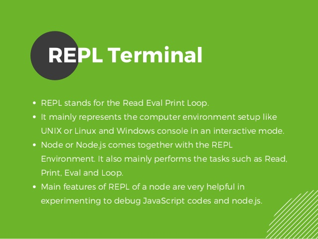

### Overview
	
Introduces you to a CLI tool to quickly run your Node.Js code on your local environment. Briefs you as to where it is beneficial and how to go about using it by introducing you to its basic commands.

### Learning Outcomes
- What is REPL?

- Where & how is REPL used?

- What are some basic commands in REPL?

### Introduction
- REPL (READ, EVAL, PRINT, LOOP) is a computer environment similar to Shell (Unix/Linux) and command prompt. Node comes with the REPL environment when it is installed. System interacts with the user through outputs of commands/expressions used. It is useful in writing and debugging the codes. The work of REPL can be understood from its full form:
	- Read : It reads the inputs from users and parses it into JavaScript data structure. It is then stored to memory.
	- Eval : The parsed JavaScript data structure is evaluated for the results.
	- Print : The result is printed after the evaluation.
	- Loop : Loops the input command. To come out of NODE REPL, press ctrl+c twice
- Commonly used REPL Commands
	- ctrl + c − terminate the current command.
	- ctrl + c twice − terminate the Node REPL.
	- ctrl + d − terminate the Node REPL.
	- Up/Down Keys − see command history and modify previous commands.
	- tab Keys − list of current commands.
	- .help − list of all commands.
	- .break − exit from multiline expression.
	- .clear − exit from multiline expression.
	- .save filename − save the current Node REPL session to a file.
	- .load filename − load file content in current Node REPL session

### What you must do
- Understand [what is REPL](https://www.digitalocean.com/community/tutorials/how-to-use-the-node-js-repl)
- Understand [where & how REPL is used](https://medium.com/trabe/mastering-the-node-js-repl-part-1-156ca2ee886a)
- Understand [basic commands in REPL](https://medium.com/trabe/mastering-the-node-js-repl-part-2-365c52a5203d)

### Additional Resources
- Further get a better [understanding of REPL](https://hackernoon.com/know-node-repl-better-dbd15bca0af6)
