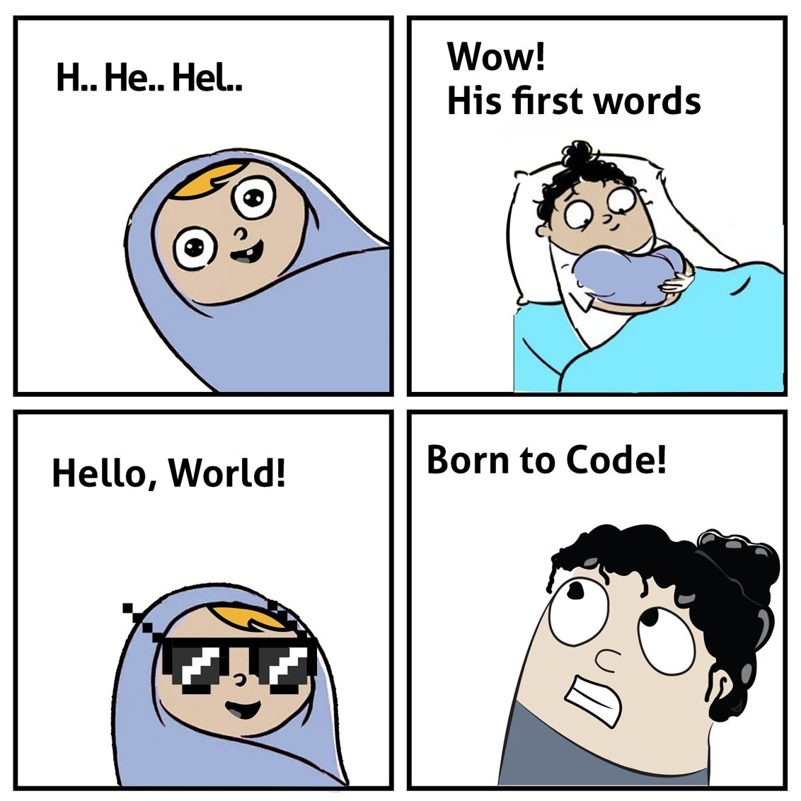

### Overview

This takes you through the experience of running your first ever program in Node.Js on the local development environment that we have setup in earlier sections. Gives you an understanding of IO in Node.Js and how to deal with it to utilize in your first ever awesome program for this course.

### Learning Outcomes
- What are basics of IO in Node.Js?

- How to run your first program?

### Introduction
- Time to say hello to this world!

### What you must do
- Take a look at this [article](https://code.visualstudio.com/docs/nodejs/nodejs-tutorial) and try running the same code on your machine

### Additional Resources
- Take a look at this [article](https://flaviocopes.com/node-input-from-cli/) and try running the same code on your machine
- Take a look at this [article](https://medium.com/@adnanrahic/hello-world-app-with-node-js-and-express-c1eb7cfa8a30) and try running the same code on your machine
