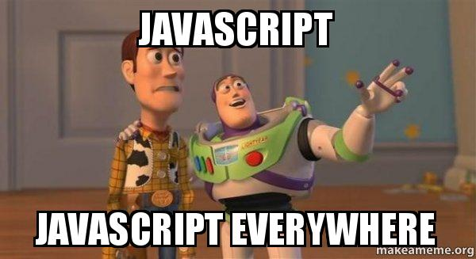

### Overview

This introduces you to the basic constructs in Javascript. This is where you begin to learn of how you can express your logic using a programming language and get small chunks of it running to build something useful.

### Learning Outcomes
- What are variables, where they are used and how to use them?

- What are data types & how type conversions work?

- How is flow controlled in Javascript?

- How to Loop through data?

- How to print result of your program?

- What are arrays & objects?

- What are functions? How can we benefit by using these?

- What is scoping? How are variables and functions scoped?

### Introduction
- Basic constructs to learn in Javascript
	- Variables
	- Data types
	- Type conversions
	- Logical operators
	- Loops
	- Conditionals
	- Printing
	- Arrays & objects
	- Functions
	- Scoping

### What you must do
- Get started by understanding the [basics of javascript](https://medium.com/swlh/introduction-to-javascript-basics-cf901c05ca47)
- Get a grasp on the basic [datas-types in Javascript](https://codeburst.io/javascript-essentials-types-data-structures-3ac039f9877b)
- Understand [how type conversions are handled](https://dev.to/pixelgoo/understanding-javascript-type-conversions-43n)
- Understand how [conditionals in Javascript](https://developer.mozilla.org/en-US/docs/Learn/JavaScript/Building_blocks/conditionals) work
- Understand how [loops in Javascript](https://www.tutorialrepublic.com/javascript-tutorial/javascript-loops.php) work
- Understand how [arrays and objects in Javascript](https://scotch.io/courses/10-need-to-know-javascript-conceptsdata-structures-objects-and-arrays) function
- Understand the [basics of functions in Javascript](https://codeburst.io/javascript-functions-understanding-the-basics-207dbf42ed99)
- Underestand [basics of scope in Javascript](https://scotch.io/tutorials/understanding-scope-in-javascript)

### Additional Resources
- Further understand [constructs in Javascript](https://medium.com/datadriveninvestor/javascript-for-beginners-01-getting-started-56a4e55f43bf)
- Further grasp [scope in Javascript](https://www.digitalocean.com/community/tutorials/understanding-variables-scope-hoisting-in-javascript)
- Further understand [functions in Javascript](https://www.digitalocean.com/community/tutorials/how-to-define-functions-in-javascript)
- Further watch this video to revise all [Javascript constructs](https://www.youtube.com/watch?v=W6NZfCO5SIk)
