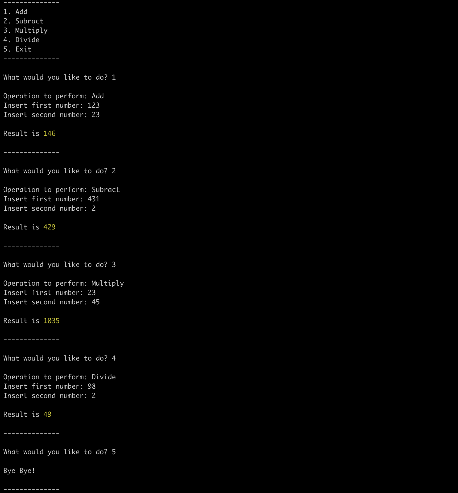

## Problem statement

Write an interactive commandline calculator application in Node.Js to support operations for addition, subtraction, multiplication, division operations where a user should be able to enter 2 operands to perform any operation.

### Specifications
- The program should be interactive and always running until user chooses to exit.
- User should be able to see list of supported operations when app starts.
- User should be able to select which operation to perform.
- User should be able to input operation and both the operands.
- User should be able to see the selected operation and result of the operation.
- User should be given an option to exit from the program.
- User should get an error which appropriate message if a wrong operation is selected.
- User should get an error if any operand is not a number.
- User should get an error if any operand is empty or more than 3 digits.
- If any error occurs, error to be displayed and program to accept operation again.

### Output

