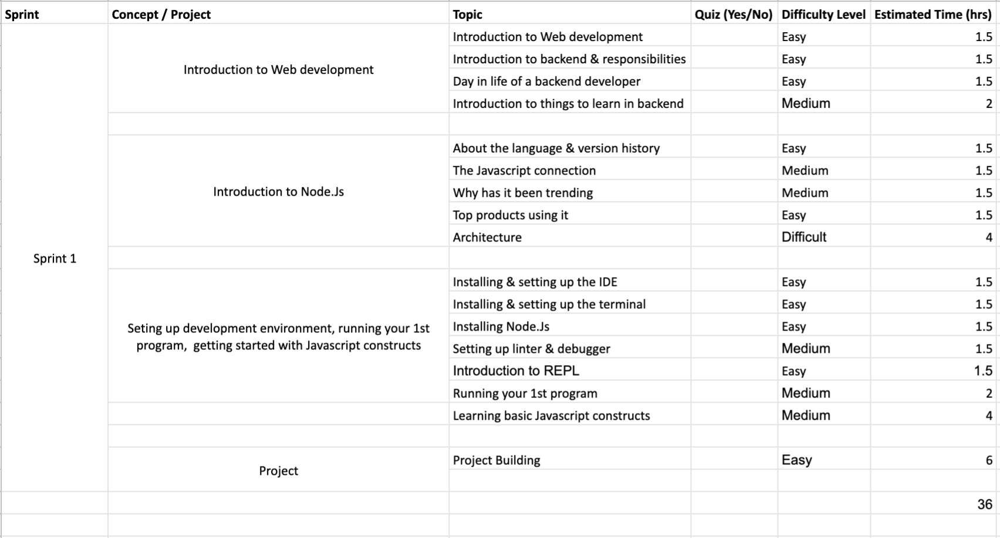

## Sprint 1 - Foundations of Web development

### Overview

Gets you started with overalls of Web development by walking you through major components involved, common roles and providing information on role-wise responsibilities. Introduces you to Node.Js ecosystem by briefing you about its core architecture and internals. Also, guides you through your first hands-on project in Node.Js.

### Learning Outcomes
- Introduction to Web development
	- Introduction to Web development
	- Introduction to backend & responsibilities
	- Day in life of a backend developer
	- Introduction to things to learn in backend
- Introduction to Node.Js
	- About the language & version history
	- The Javascript connection
	- Why has it been trending
	- Top products using it
	- Architecture
- Seting up development environment, running your 1st program,  getting started with Javascript constructs
	- Installing & setting up the IDE
	- Installing & setting up the terminal
	- Installing Node.Js
	- Setting up linter & debugger
	- Introduction to REPL
	- Running your 1st program
	- Learning basic Javascript constructs

### What will you build?
Project X

### Content tree

