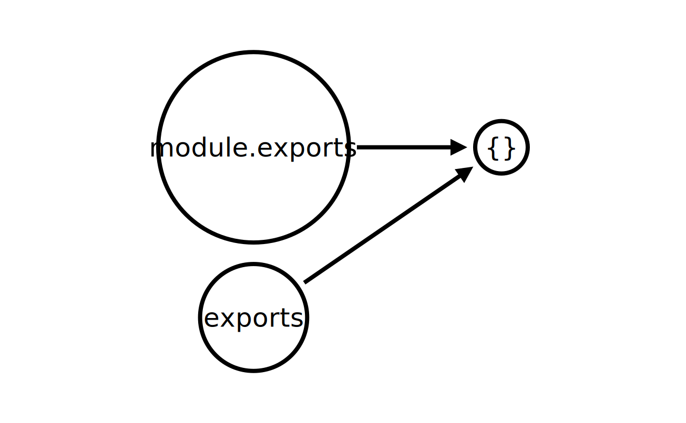

### Overview
Now that we know how to import core modules and third part modules, let us go head and see how to create our own modules and export it.

### Learning Outcome
- How to create a module?
- How to export the created module so that we can use it in our application?
- What is module object?
- What’s the Difference Between module.exports and exports?

### Introduction
Now additional to the core modules and npm modules we have, Node.js has the ability to create custom modules and allows you to include those custom modules in your Node.js application. We might have to build our modules which has the unique functionalities of our app and which will help us organise our code in a better way, decouple it and make it reusable. 
In our project, we have built our DataValidation module which validates email and phone of the employee, also we have built DatabaseOperations module which does all the functions related to data operations.
and we have required both these files in our server.js file. Please check the project details [here]((../6.%20project)).

### What you must do
- Read how to [Create, Publish, Extend & Manage our custom modules in Node](https://www.guru99.com/node-js-modules-create-publish.html)
- Watch summary of [how to create a node js module](https://www.youtube.com/watch?v=Cxo4UKpHv5s)
- Dive deep into [how-to-create-a-node-js-module](https://www.digitalocean.com/community/tutorials/how-to-create-a-node-js-module)
- Read [difference between module.exports and exports](https://stackoverflow.com/questions/16383795/difference-between-module-exports-and-exports-in-the-commonjs-module-system)
- Revise everything about module in this video by Jeremy Foster on [Mastering Node.js Modules](https://www.youtube.com/watch?v=OTE8_lh_6MY).
- Know whether [node js modules are singletons] (https://medium.com/@lazlojuly/are-node-js-modules-singletons-764ae97519af)

#### Additional Resources
- Read in depth about [How to use module.exports in Node.js](https://stackabuse.com/how-to-use-module-exports-in-node-js/).

### Summary 
Now let's look at how to create our module and export it. So that we can use it elsewhere in our application.
Let us do it by creating a calculator Node module and then use the calculator module in another file. 

Create calculator.js and add the code below:
```
    // Returns sum of two numbers
    const add = function (a, b) {
        return a+b;
    }; 
```

Now create an index.js file in the same folder and add this:
```
    let calculator = require('./calculator'); //import the module
    
    const a=10, b=5;
    
    console.log("Sum : " + calculator.add(a, b));
```

Note: You import a module you created in same way like we imported a core or a third party module

Run the program using node index.js and you should see the following output to the terminal:
```
    Sum : 15
```

So what has happened here ? If you look at the calculaor.js file, you’ll notice that we’re defining a add function, then using the exports keyword to make it available for import elsewhere. Then in the index.js file, we’re importing this function and executing it. Also notice that in the require statement, the module name is prefixed with ./, as it’s a local file. Also note that there’s no need to add the file extension.


### Exporting multiple methods and values 
calcular.js
```
    // Returns sum of two numbers
    const add = function (a, b) {
        return a+b;
    }; 
    // Returns difference of two numbers
    const subtract = function (a, b) {
        return a-b;
    }; 
    
    // Returns product of two numbers
    const multiply = function (a, b) {
        return a*b;
    }; 

    exports.add = add;
    exports.subtract = subtract;
    exports.multiply = multiply;
```

index.js
```
    let calculator = require('./calculator'); // you can give any name to the variable not necessary to name it calculator and it will work fine
    
    const a=10, b=5;
    
    console.log("Sum : " + calculator.add(a, b));
    console.log("Difference : " + calculator.subtract(a, b));
    console.log("Product : " + calculator.multiply(a, b));
```

Run the program using node index.js and you should see the following output to the terminal:
```
    Sum : 15
    Difference : 5
    Product : 50
```

You can also export values and methods as you go, not just at the end of the file
Example: calculator.js
```
    // Returns sum of two numbers
    exports.add = function (a, b) {
        return a+b;
    }; 
    // Returns difference of two numbers
    exports.subtract = function (a, b) {
        return a-b;
    }; 
    
    // Returns product of two numbers
    exports.multiply = function (a, b) {
        return a*b;
    }; 
```

and then import in  index.js in the same way.

### Exporting a module using module.exports
You can also export functions and variables using modules.export.
calcular.js

```
module.exports = {
    add = function (a, b) {
        return a+b;
    },
    subtract = function (a, b) {
        return a-b;
    },
    multiply = function (a, b) {
        return a*b;
    }
};

```

Here we’re assigning the functions and values we want to export to an exports property on module.
Now import in index.js in the same way.
```
    let calculator = require('./calculator'); // you can give any name to the variable not necessary to name it calculator and it will work fine
    
    const a=10, b=5;
    
    console.log("Sum : " + calculator.add(a, b));
    console.log("Difference : " + calculator.subtract(a, b));
    console.log("Product : " + calculator.multiply(a, b));
```
Output: 
```
    Sum : 15
    Difference : 5
    Product : 50
```

This works just fine.

#### So what is the difference between module.exports and exports?
To illustrate what I mean, let’s change the code in index.js to log the value of module:
Output: 

```
    Module {
    id: '.',
    exports: {},
    parent: null,
    filename: '/home/jim/Desktop/index.js',
    loaded: false,
    children: [],
    paths: //paths array}
```
If you loot at the output module has an exports property. Let’s add something to it:

index.js
```
    exports.test = 'test';
    console.log(module);
```

Output 
```
    Module {
    id: '.',
    exports: { test: 'test' },
    ...
```

Adding properties to exports also adds them to module.exports. This is because exports is a reference to module.exports.
In simpler terms, initially, exports and module.exports point at the same empty object.
    

So, now you know, exports is shortcut for referencing module.exports, if your module is to export an object. But there is caveat here. 

If you export like below
```
    exports.a = 'a';
    module.exports.b = 'b';
```

This code would result in the module’s exported object being { a: 'a', b: 'b' }.

But if you override the module.exports value like this - 
```
    exports.a = 'a';
    module.exports = () => { console.log('b'); };
```

Then, whatever you assign module.exports to is what’s exported from your module. exports.a will be ignored.
Print the value of module now and se the differnce.


