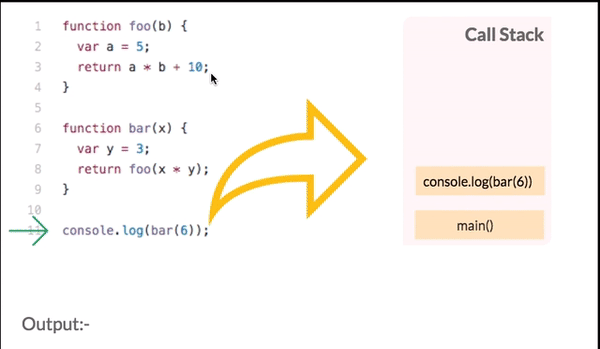

### Overview
In last chapter we learnt why is Node Asynchronous. In this section we woud go futher deeo and understand the internal of how asychronous code executes. Also introduces you to few concepts related to asynchronous programming in Node like callstacks, callbacks, event loops and Promises.

### Learning Outcome
- What is a Callstack?
- What is Callback Queue?
- What is Event loop?
- How to handle Asynchronous code using callbacks and promises?
- What is a callback hell?
- How to avoid it?

### Introduction
Understanding the flow of execution of a program in any language helps you design and architect the code is the most effecient way. Let is see how asychronous code executes in node. 
Also Though Asynchronous programming in Node has a lot of advantages. But it also a few drawbacks like, Asynchronous code consists of multiple nested callbacks which makes code hard to read and debug. These multiple nested callbacks leads to something called as a callback hell. So in this section we will aslo go through how to handle issues in asychronous code.

### What you must do
- This blog explains [how asychronous gets executed](https://blog.sessionstack.com/how-javascript-works-event-loop-and-the-rise-of-async-programming-5-ways-to-better-coding-with-2f077c4438b5)
- Learn more about [callstacks](https://www.javascripttutorial.net/javascript-call-stack/) with examples.
- Watch this video which explains [Event loop](https://www.youtube.com/watch?v=8aGhZQkoFbQ&t=7s) in detail.
- Read [How Node and Javascript handle asynchronous functions](https://medium.com/@thejasonfile/how-node-and-javascript-handle-asynchronous-functions-7feb9fc8a610)
- Read in depth about [Callbacks](https://nodejs.org/en/knowledge/getting-started/control-flow/what-are-callbacks/)
- Read about [how code structure, using modules, promises and Async.js can help us avoid callback hell](https://stackabuse.com/avoiding-callback-hell-in-node-js/).
- Read more on [Callback hell](http://callbackhell.com/)
- Understand various [ways to void callback hell] https://ciphertrick.com/avoiding-callback-hell-node-js/.
- Futher watch a video on [how to avoid callback hell](https://www.youtube.com/watch?v=Ir9-EBbc9fg)


#### Additional Resources
- Watch this video which explains [About the Call Stack, Event Loop, Callbacks and Promises in JavaScript](https://www.youtube.com/watch?v=RRgAdi3gX-s)
- Watch a video on [Callbacks](https://www.youtube.com/watch?v=ui4-OADfgIk).
- Read about [Promise chaining](https://javascript.info/promise-chaining) and [async-await](https://javascript.info/async-await).

#### Summary

- In the last chapter we saw an example of setTimeout to make code block asynchronous.
    ```
    console.log("Start executing the code.");
    setTimeout(() => {
        console.log("First.");
    }, 1000);

    console.log("Second.");
    ```
    Output:
    ```
    Start executing the code.
    First.
    Second.
    ```

    You must be wondering how does the 1 minute setTimeout delay not prevent the rest of the code from executing. To understand this let us understand the concept of Event loop.

    

- The event loop is in the heart of Node.js / Javascript - it is responsible for scheduling asynchronous operations.
- Let us understand each term in the diagram above with examples
    - Callstack: 
        - At the most basic level, a call stack is a data structure that uses the Last In, First Out (LIFO) principle to temporarily store and manage function invocation
        - This is where all your javascript code gets pushed and executed one by one as the interpreter reads your program, and gets popped out once the execution is done. If your statement is asynchronous: setTimeout, ajax(), promise, or click event, then that code gets removed from Main Stack and forwarded to Event table, this table is responsible for moving your asynchronous code to callback/event queue after specified time.

            

    - Heap - This is where all the memory allocation happens for your variables, that you have defined in your program.
    - Callback Queue: This is where your asynchronous code gets pushed to, and waits for the execution.
    - Event Loop: The event loop continuously checks the call stack to see if there’s any function that needs to run. While doing so, it adds any function call it finds to the call stack and executes each one in order. if there is noting to execute in stack then it checks Callback queue, if Callback queue has codes to execute then it pops the message from it to the Main Stack for the execution.
- Callbacks:
    - If you carefully notice any asynchronous code block in node, Like the setTimeout function it has a function within setTimeout which prints "First" after 1 second. Such functions are called calledback functions in JS.
    - By definition - A callback is a function which is called when a task is completed, thus helps in preventing any kind of blocking and a callback function allows other code to run in the meantime.
    - Using Callback concept, Node.js can process a large number of requests without waiting for any function to return the result which makes Node.js highly scalable.

    Look at the example below:
    ```
    import fs from 'fs';
    fs.readFile('/testFile', 'utf8', (err, data) => {
        if (err) { 
            throw err 
        } else {
            validate(data);
        }
    });
    ```

Here we are reading the file asynchronously and once the file is read we have a function which executes that validates the dat athat is fetched. This is callback. The callback would be called at the end of this turn of the NodeJs event loop. 

- Callback hell is a phenomenon that afflicts a JavaScript developer when he tries to execute multiple asynchronous operations one after the other. Some people call it to be the pyramid of doom.
Let’s have a look at an example of what we call callback hell.

```js
    // 4 times nested calls...
    fs.readFile('/test1', 'utf-8', (err1, data1) => {
        if (err1) {
            return handleError(err1); 
        } else {
            fs.readFile(data1, 'utf-8', (err2, data2) => {
                if (err2) { 
                    return handleError(err2);
                } else {
                    fs.readFile(data2, 'utf-8', (err3, data3) => {      
                        if (err3) {
                            return handleError(err3);   
                        } else {
                            fs.readFile(data3, 'utf-8', (err4, data4) => {        
                                if (err4) { 
                                    return handleError(err4);
                                } else {        
                                // ...continue after all scripts are loaded (*)    
                                }
                            });    
                        });
                    }
                }  
            });
        }
    });
    //Note- The above code is for demonstration and not a working code.
```
In the code above:
    - We load test1, then if there’s no error.
    - We load data1 then if there’s no error.
    - We load data2, then if there’s no error 
    - We load data3, then if there’s no error - do something else (*).
As you can see, this can really get out of hand. In the above example, each callback depends on the result obtained from parent callback. As calls become more nested, the code becomes deeper and increasingly more difficult to manage and hard to read, especially if we have real code instead of ... that may include more loops, conditional statements and so on. Beginners especially fall victim to this, not understanding how to avoid this "pyramid of doom".
The “pyramid” of nested calls grows to the right with every asynchronous action. Soon it spirals out of control. So this way of coding isn’t very good.

- Ways for avoiding callback hell
    - Using Promises
    - Using Async-Await
    - Using Async.js

We all know what promise and how to chain a promise. Let us see how we can solve the callback hell problem in the above example using promises -

```
fs.readFile('/test1', 'utf-8')
    .then(data1 =>
        fs.readFile(data1, 'utf-8')
    )
    .then(data2 =>
        fs.readFile(data2, 'utf-8')
    )
    .then(data3 =>
        fs.readFile(data3, 'utf-8')
    )
    .then(data4 =>
        doSomething(data4)
    )
    .catch(err =>
        handleError(err)
    );
```

The idea is that the result is passed through the chain of .then handlers.

Here the flow is:
    - The initial promise resolves and,
    - Then the .then handler is called to load data1.
    - Then the .then handler is called to load data2 …and so on.
    - Now in between if anything fails it goes to the catch function.


