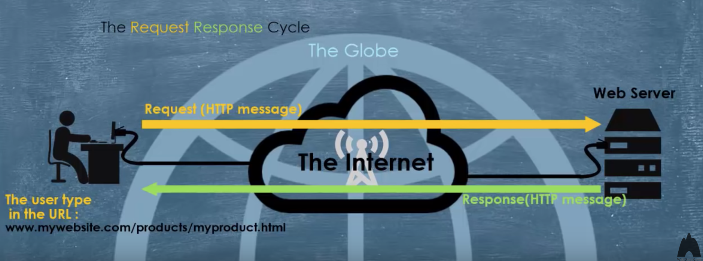
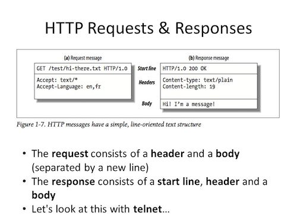

### Overview
Now that we going deep into web development, it is important that we understand how the world wide web works at a fundamental level. And the core technology is HTTP - Hypertext Transfer Protocol. It's the communication protocol you use when you browse the web. This section introduces you to what HTTP is, HTTP architecture and CRUD operations using http. Irrespective of the backend program language you learn this are topics or concepts are the ones that every backend needs to know.

### Learning Outcome
- What is HTTP?
- HTTP architecture.
- How HTTP works

### Introduction
We also know that HTTP is communication protocol used for browsing the web, a set of rules for how to transfer data on the web.
HTTP specification specifies how clients' request data will be constructed and sent to the server, and how the servers respond to these requests. Let us dig deep and how the entire communication and request respone cycle works, what are the various elements of it. How is the request sent, what is the format of the request, how is response sent, various rules associcated with. All this will lay foundation to what to learn in the next section so be thorough with this concept.

- Request Response Cycle

    

### What you must do
- Read about [The Http and the Web](https://www.youtube.com/watch?v=eesqK59rhGA)
- Dive deep into [HTTP protocol](https://code.tutsplus.com/tutorials/http-the-protocol-every-web-developer-must-know-part-1--net-31177)
- Understand [HTTP basics](http://www.steves-internet-guide.com/http-basics/) and its various components like request and response structure, URI etc
- Read about [HTTP Messages](https://developer.mozilla.org/en-US/docs/Web/HTTP/Messages)
- Learn about  
    - [HTTP status codes](https://www.tutorialspoint.com/http/http_status_codes.htm), 
    - [HTTP-Requests](https://www.tutorialspoint.com/http/http_requests.htm), 
    - [HTTP Headers](https://www.geeksforgeeks.org/http-headers/)
    - [HTTP Methods](https://www.tutorialspoint.com/http/http_methods.htm)
    - [HTTP-Responses](https://www.tutorialspoint.com/http/http_responses.htm)
- [Understand the basics of how your web browser communicates with the internet using HTTP requests](https://www.codecademy.com/articles/http-requests)
- Watch this video which explains various [parts of an HTTP request](https://www.youtube.com/watch?v=pHFWGN-upGM)

#### Additional Resources
- Further take a look on another take on [HTTP bascis](hhttps://www.ntu.edu.sg/home/ehchua/programming/webprogramming/HTTP_Basics.html).
- [An introduction to HTTP](https://www.freecodecamp.org/news/http-and-everything-you-need-to-know-about-it/): everything you need to know

### Summary 
#### HTTP
- HTTP stands for Hypertext Transfer Protocol
- It is an application protoccol for transferring Resources across the internet
- It is a set of rules for how to transfer data on the web. 
- You've seen http:// in web addresses, of course. Now you’re going to use the same protocol to transfer data between your app and the server.

#### HTTP architecture
- The following diagram shows a very basic architecture of a web application and depicts where HTTP sits:

    

- The HTTP protocol is a request/response protocol based on the client/server based architecture where web browsers and search engines, etc. act like HTTP clients, and the Web server acts as a server.

- Client
The HTTP client sends a request to the server in the form of a request method, URI, and protocol version, client information, and request data over a TCP/IP connection.

- Server
The HTTP server responds with a response to the client. The response has any parts to it like the status code, nody etc.

#### How HTTP works
- Request Response Cycle
    - HTTP sessions are opened by an HTTP Client i.e user browser and a connection Request Message is sent to an HTTP Server (i.e. the Web Server). The Request Message is also known as the ‘Client Request’.
    - Once the response has been delivered the Web Server closes the connection. This type of connection is known as Stateless in that it exists only for the duration of the data exchange.

    - Depending on the availability or otherwise of the Resource HTTP provides an appropriate status code (also referred to as the ‘Server Response’) determined by the protocol. These are as [follows](https://www.tutorialspoint.com/http/http_status_codes.htm).

        

    - In above image we see certain HTTP verbs are sent by clients to the server. This is known as a request. After the server receives a request it processes it and then sends back a response to the client. Both the request and the response contain metadata known as headers. The primary data itself is sent in the body.

- Based on the requirement client users approriate HTTP Methods. Few of them are:
    - GET - for requesting data from the server
    - POST - for sending new data to the server
    - PUT - for updating data on the server (fully replace an existing resource)
    - PATCH - for updating data on the server (partially modify an existing resource)
    - DELETE - for deleting data on the server

    

