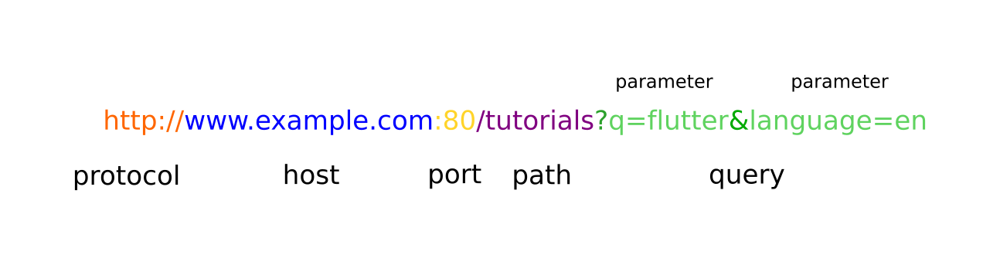

### Overview
The World Wide Web can be conceived as a large group of resources placed in different computers, all around the world. To make references and find these resources, the web relies on URI, a system that's been designed to name and locate a specific resource in an unambiguous way. Let's start with the introduction to URI and its components.

### Learning Outcome
- What is URI?
- Components of URI.

### Introduction
- A URI (Uniform Resource Identifier) is an address for a resource. A resource, for example, could be a webpage or a file or a database row. A specific type of URI is a URL.
- You’re probably familiar with URIs from your mobile app development and certainly familiar with URLs from web browsers 
- URI is contructed using the following components - 

```
[protocol][computer_name or host:port][directories_path][file]
```
Example: 
    


- Practical example of URI 
    - When client app accesses resources on our server, it will use a URI to reference them. Here is an actual example that we will use:

    Let's consider an example where you want identify the USER on the basis of userID

    ```
    GET /user/{userID}

    http://localhost:3000/user/21
    ```

    - We’ll be using localhost (that is, 127.0.0.1) to refer to our own machine, where the server will be running. This will simplify the development process. Then we will (somewhat arbitrarily) choose port 3000 to communicate over. Our path is /user. We could have used something like /fruit or /items. In fact, a more complex server app would probably define several different paths (also known as routes) that clients could connect to to access different types of resources. In our minimal server, though, we’ll just use one path. The final 21 at the end of the path will be used as a parameter to refer to the ID of a database row. 
    In a nutshell what this url will do is it will fetch the user details for the user with ID 21.

### What you must do
- Futher read about other URI components like protocol, host, path etc [here](https://doepud.co.uk/blog/anatomy-of-a-url)
- Read more about [URI](https://www.htmlquick.com/reference/uri-url.html)
- Watch a video which explains [Path vs Query Parameters in HTTP Requests](https://www.youtube.com/watch?v=tG7x9Ty1ocg)

#### Additional Resources
- Watch video on [Difference between URI and URL](https://www.youtube.com/watch?v=vpYct2npKD8&t=305s)

### Summary
- Path Param 
    - 21 is above example is also called a path param. Path Param is basically used to identify a specific resource or resources 

- Query Param 
    - Query Parameter is used to sort/filter those resources.
    - Example
    ```
        GET /user?gender=male
    ```
    - This will return all the users whose gender is male.
    - We can add more filters by separating Query Parameter using &.
    Example:
    ```
        GET /user?gender=male&age=50&country=india
    ```
    This will return all the users whose gender is male and age is 50 and country is india.