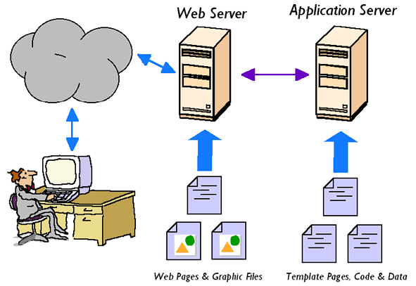
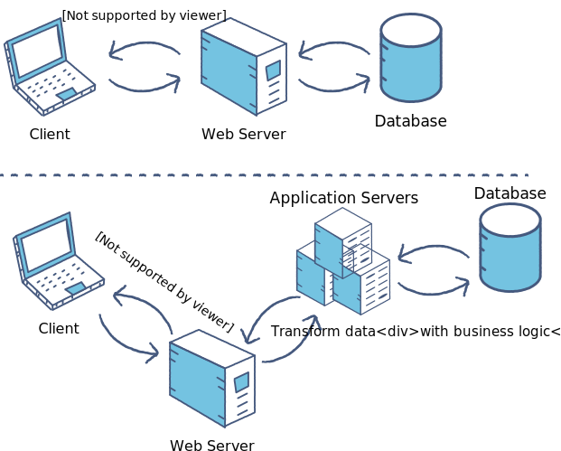

### Overview
When you enter the address of a web page in your browser, say Amazon or eBay. Do you know how the page gets rendered? or when you want to fetch data from the database or save data into the database fron the browser or your javascript code. How do you do that? Wh
Before getting into actual backend development world. It is important to understand how are web pages rendered, how is data transferred from backend to the front end or othe backend application? A simple answer to this is via servers.
In the first concept, we saw what purpose do servers serve. And there are various kinds of servers, each with a different responsibility. Let us look at the two most important types of servers - Web and applications servers

### Learning Outcome
- What is a Web server?
- What is an application server

### Introduction
- A web server stores and delivers the content for a website – such as text, images, video, and application data – to clients that request it. 
- Many people familiar with how to view and navigate web pages, but have limited knowledge of how those web pages do what they do. 
-  When someone sits down at a computer and enters an address into an internet browser like Internet Explorer or Firefox, the browser sends a request off into the internet asking to view the web page found at that address. 
- The web server is the program or machine that responds to that request, and delivers the content of the page back to the user.
- A web server communicates with a web browser using the Hypertext Transfer Protocol (HTTP). The content of most web pages is encoded in Hypertext Markup Language (HTML). 

    

- In short, Web Server will send the HTML as output for all requests sent to the server. It does not have any backend logic.

- Application server is an extension to Web server, Application server is where complex and large applications reside. It can have backend logic and makes the application dynamic by interacting with the Database servers. Application deployment happens on the application server. An application server can also handle the services and requests which a web server can handle. This means that there is an in-built web server in application servers.

    

    

### What you must do
- Understand [What Is A Server - Web Server, Application Server](https://www.youtube.com/watch?v=Nu-18s6EeM8)
- Read about [What Are Web Servers?, Why Are They Needed? and how do they work?](https://webhostinggeeks.com/blog/what-are-web-servers-and-why-are-they-needed/)
- Dive deep into [What is a web server](https://developer.mozilla.org/en-US/docs/Learn/Common_questions/What_is_a_web_server)
- Read about [what is an application server and What's the difference betwen web and app server? ](https://www.javaworld.com/article/2077354/app-server-web-server-what-s-the-difference.html)
- Watch [Whats the difference between Web and App Server](https://www.youtube.com/watch?v=S97eKyv2b9M)

#### Additional Resources
- Read about [How web servers work](https://www.geeksforgeeks.org/web-servers-work/).
- Further take a look on another take on [What are web servers and how do they work (with examples httpd and nodejs)](https://www.youtube.com/watch?v=JhpUch6lWMw)