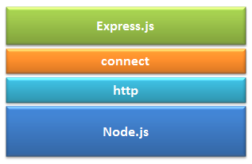

### Overview
So far, whatever we have created, was only accessible via commandline, that's a great way to get started. But if we look at it, it is not realistic for the end users to interact via commandline. What if the user can just hit a url and interact with our applications. In simple simple terms, what if we build API's in our application and expose it, so that end users can use it to pull the data or send the data to our application or render webpage? That is exactly what we would be doing in this concept using Express JS. We would be creating our web server in Node.js.

### Learning Outcome
- What is Express?
- Why use Express?
- How to set up our first Express Server?
- How to write a route using Express?

### Introduction
All the backend developers in any organisation are expected to know how to build API's. We already know the importance of it.
So lets go ahead and see how can we API's in Node.js.

In the one of the previous chapters, we read that When someone visits a web page on your site their browser communicates with your *web server*, sending and receiving information that ultimately dictates what appears on the visitor’s computer screen. 
In node we have a in-built module "http" that is used to create a web server. Basically helps use create REST API's we can be used for communication between the application. So if we have http module why use an external web framework?
As MDN has described this - Other common web-development tasks are not directly supported by Node itself. If you want to add specific handling for different HTTP verbs (e.g. GET, POST, DELETE, etc.), separately handle requests at different URL paths ("routes"), serve static files, or use templates to dynamically create the response, Node won't be of much use on its own. You will either need to write the code yourself, or you can avoid reinventing the wheel and use a web framework. Express.js is of the most popular web server in Node.js. 

To get started, let's look at what express.js is and will see how to build API's using Express in our subsequent sections.

### What you must do
- Revise all the HTTP, API and CRUD concepts we learned in previous topics. Thorough understanding of what we learnt in  [Intoduction to APIs](../3.%20Introduction%20to%20APIs) section is going to the base of what we do next, or even when you build API's in other programming languages.
- Watch these videos which explains 
    - [What is express](https://scotch.io/courses/build-a-restful-nodejs-api/what-is-expressjs). This video also shows you how express.js makes things simpler compared to http server in node.js. 
    - [What is REST](https://scotch.io/courses/build-a-restful-nodejs-api/what-is-rest).
- Read [how to install express](https://expressjs.com/en/starter/installing.html) on the official documentation.
- Before starting the next chapter it is important to understand [What is Routing](https://expressjs.com/en/starter/basic-routing.html).
- Read more about [app.METHOD](https://expressjs.com/en/api.html#app.METHOD)
- Read about the [request object in express](https://expressjs.com/en/4x/api.html#req)
- Read about the [response object in express](https://expressjs.com/en/4x/api.html#res)
- Read about [Routing, Route methods, Route paths, Route parameters](https://expressjs.com/en/guide/routing.html)
- Read [Express/Node introduction](https://developer.mozilla.org/en-US/docs/Learn/Server-side/Express_Nodejs)
- Read a blog on [Why use ExpressJS over NodeJS for Server-Side Development?](https://www.algoworks.com/blog/why-use-expressjs-over-nodejs-for-server-side-coding/)

### Additional Resources
- This explains [basic concepts of Express](https://www.freecodecamp.org/news/going-out-to-eat-and-understanding-the-basics-of-express-js-f034a029fb66/) with a fun example. Have a look at it.
- Watch how to [create HTTP Server](https://www.youtube.com/watch?v=VLXAzzRjQws) using HTTP Module in Node.js

### Summary
This concept covers all the pivotal topics of REST API's using express and Node. To better onboard the topics, we will also be building a simple 'Employee Manageent App' throughout the concept. Read about the project details [here](../7.%20project/project.md)
- Express is a minimal, open source and flexible Node.js web app framework designed to make developing websites, web apps, & API’s much easier.
- It provides various features that make web application development fast and easy which otherwise takes more time using only Node.js. 
- In short, ExpressJS did for NodeJS what Bootstrap did for HTML/CSS and responsive web design. It made coding in NodeJS a piece of cake and gave programmers some additional features to extend their server-side coding. 
- Express.js is based on the Node.js middleware module called connect which in turn uses http module. So, any middleware which is based on connect will also work with Express.js.

    

#### Setting your Express Server
1. Installing & using Express
- You can get it through NPM. Go the terminal and inside and project folder execute the command bellow:
```
npm install express --save
```

2. Create Basic express app: 
- Step 1: Paste the following code in your server.js or main application file:
```js
    const express = require('express');
    var app = express();
    app.listen(process.env.PORT || 3000);
```
What does the above code block mean - 
- Line 1: We are importing Express like we would import any external/ third-party module using require.
- Line 2: We are creating the express app by setting it to the app variable.
- Line 3: app.listen is going to bind the application to the port on our machine. This the port what you application will run.


- Step 2:  Creating a route using express
The following function is used to define a route in Express
```
app.method(path, handler);
```
- Method can be any one of the HTTP verbs i.e GET, POST, PUT and DELETE.
- Path: This is the path/route the user will hit to access this API
- Handler: A callback function that executes when a matching request type is found on the relevant route.

Example
```
    app.get('/', (req, res) => {
        res.send('My first Express app')
    });
```

- Step 2:  Run you server.js file
```
 node server.js
```
If you want to expose a GET API to the client you use app.get.
app.get is saying that when it gets that route it should give the response that is specified in the function. It takes in 2 arguments: 
    - (1) the url or the route 
    - (2) the function that tells express what to send back to the person making the request. req is the request that the user has send and using res i.e response we send back the response to the user. res.send means you are sending the response.

- Step 3: Step 6: Go to your browser and go to port 3000. 

```
http://localhost:3000/
```
You should see “My first Express app” on the webpage. Now how does this happen:
Since our app runs on port 3000 locally our domain is "http://localhost:3000" and when you "/" after this domain,  the server receives a get request at route "/". Our Express app executes the callback function attached to this route and sends "My first Express app!" as the response.

This way you can define multiple routes in express.


