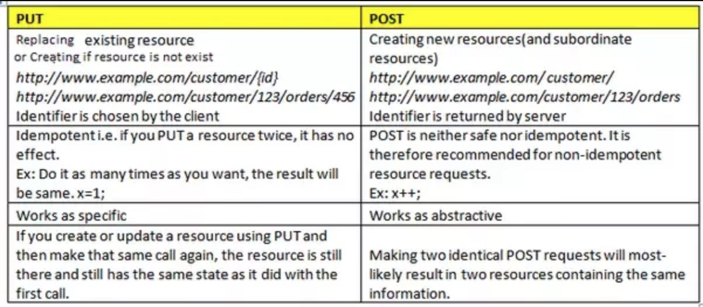

### Overview
In this tutorial we will learn how to respond to POST and PUT requests using Express.

### Learning Outcome
- What is a POST request?
- How to create a POST API using Express?
- How to get POST and PUT parameters i.e read data that is sent in the request?
- What is a PUT request?
- How to create a POST API using Express?

### Introduction
Now that we know how to to write an API that returns the requested data to the user. Let us now look at the API's that will create data or update the data in the backend. Imagine you are a big bazar admin and you want to add a new customer or update the email or any other details of a customer in your database. For these scenarios we need a POST and PUT API. 
- To handle a request where user wants to add a new record or create a new resourse we need to create a POST API and to handle the update request we need to create and expose a PUT API.
- As we have learnt earlier in this sprint. both PUT and POST is the HTTP method that is designed to send loads of data to a server from a specified resource. This method allows data to be sent as a package in a separate communication with the processing script. This means that data sent through the POST or the PUT method will not be visible in the URL, as parameters are not sent along with the URI.
- PUT vs POST


Let us dive deep into each of the requests and learn how to create them in Node using Express.js.
*Refer Summary section below to see the POST and PUT API's we have created in our project.*

### What you must do
- Understand [when to use GET and POST](https://www.diffen.com/difference/GET-vs-POST-HTTP-Requests)
- Read [what is a POST and PUT method in REST](https://javarevisited.blogspot.com/2016/10/difference-between-put-and-post-in-restful-web-service.html#axzz6I4IG9rMS) and what is the difference between the two.
- Watch this video revise the [Rest Concepts and further watch on how to write a POST and PUT API in Express](https://www.youtube.com/watch?v=pKd0Rpw7O48&t=65s). Skip the first 30 minutes of the video and watch the later part.
- Read further about [how to Get HTTP POST Body in Express.js](https://stackabuse.com/get-http-post-body-in-express-js/)
- Watch this video on [Handling POST Requests](https://www.youtube.com/watch?v=rin7gb9kdpk). 
- Watch this video on [Handling PUT Requests](https://www.youtube.com/watch?v=sEkRmVfc8XE).
- Read [What does body-parser do with express?](https://stackoverflow.com/questions/38306569/what-does-body-parser-do-with-express).
- Read about [body-parser module in express](https://expressjs.com/en/resources/middleware/body-parser.html).
- Read [How bodyParser() works](https://medium.com/@adamzerner/how-bodyparser-works-247897a93b90).
- Read about [express.json()](https://expressjs.com/en/api.html#express.json)

### Additional Resources
- Read this article which explains the [Difference between the http requests POST and GET](https://medium.com/@LazaroIbanez/difference-between-the-http-requests-post-and-get-3b4ed40164c1)
- Great article on [how to design your API's](https://docs.microsoft.com/en-us/azure/architecture/best-practices/api-design)


### Summary 
Let us start by building POST and PUT API's for our project -
Note: We are using same local employees array that we used in the previous chapter.
```js
let employees = [{
    "id": 1,
    "name": "nehal",
    "email": "nehal.g@test.com",
    "phone": 1234567891,
    "address": "Mumbai 400 101",
    "designation": "developer",
    "team": "PNG"
}, {
    "id": 2,
    "name": "ankita",
    "email": "ankita.g@test.com",
    "phone": 1234567891,
    "address": "Mumbai 400 101",
    "designation": "CONSULTANT",
    "team": "CPG"
}];
```

#### How to create a POST API using Express
We need 1 POST end point for our project 
- POST : /employees : Creates a employee
    - This end point will validate the employee data that is sent in the request
    - If the data is valid, it will save the data in the database. i.e create the employee and return the data that was created at the backend which contains the id generated that record
    - If the data is not valid, it will send relevant HTTP status code along with the error message

- In this router, we need to read the employee data, which must be present in the request body. body property of the request objects returns the data that the user has passed along with the request.
- By default parsing of the requets body is disables in express, we need to enable this using 
```js
app.use(express.json());
```

Also by the convention when post an object to the server and the server creates a new object, it should return the object to the client. This is done because whenever a resource/object is created a new id is assigned to it and client might need that id.

```js
app.post("/employees", (request, response) => {
    let employeeData = request.body; // request.body returns the data the client has sent in the request
    let validateData = validateEmployeeData(employeeData);

    if(validateData.valid) { // check if the data sent by client is valid if not send bad request error to the client
        let data = DatabaseOperations.saveEmployee(employeeData);
        if(data) { // check if the data is saved successfully
            response.send(data); // return the saved data with the id that is generated.
        } else { // if not send the error to the client
            response.status(500).send("Error saving employee data in database");
        }    
    } else {
        response.status(400).send(validateData.message); //response.status sets the hhtp status code of the response. By default it is 200. 400 means bad request from the client
    }
});
```

Output:
    
    
    
    


#### How to create a PUT API using Express
We need the following PUT end point for our project 
- PUT: /employees/{id} : Updates a employee by id
    - Example: /employees/2
    - This end point will validate the employee data.
    - If the data is valid, it will update the data in the database corresponding to that id and return the updated data
    - If the data is not valid, it will send relevant HTTP status code along with the error message

```js
app.put("/employees/:id", (request, response) => {
    let pathParams = request.params; // request.params returns the paths params object. 
    let id = parseInt(pathParams.id); //get id path params
    let employeeData = request.body; // request.body returns the data the client has sent in the request
    let validateData = validateEmployeeData(employeeData);

    if(validateData.valid) { // check if the data sent by user is valid if not send bad request error to the client
        let data = DatabaseOperations.updateEmployee(employeeData);
        if(data) { // check if the data is saved successfully
            response.send(data); // return the saved data with the id that is generated.
        } else { // if not send the error to the client
            response.status(500).send("Error saving employee data in database");
        }    
    } else {
        response.status(400).send(validateData.message); //response.status sets the hhtp status code of the response. By default it is 200. 400 means bad request from the client
    }
});
```

Output: 
    
    
    