App: Organisation Employees management App

Problem statement: Create an application that will allow the organisation admin to manage their emolyee data. In this project we will work with dummy data since we are not connected to any database.

The purpose of this project to understand how to use global objects, modules, learn about HTTP and its methods, the basic contructs of backend programming like CRUD, REST and create REST API's using Express in Node.js.

Specifications:
Admin will be able to do following using CURL or postman.
- Create a new Employee with the following details
    - Name
    - email
    - phone
    - address
    - designation
    - team
Note:  Email and mobile are compulsary fields.
- See the list of all the employees working in their organisation
- Search Employee by name and email.
- Update Employee details like phone, team, address etc
- Delete/Remove an employee from the organisation

API's that we would be building and output of the same:
We would be creating the following endpoints -
- GET: /employees: Will get all the employees
    - This endpoint will fetch the employee list
    - Output:
    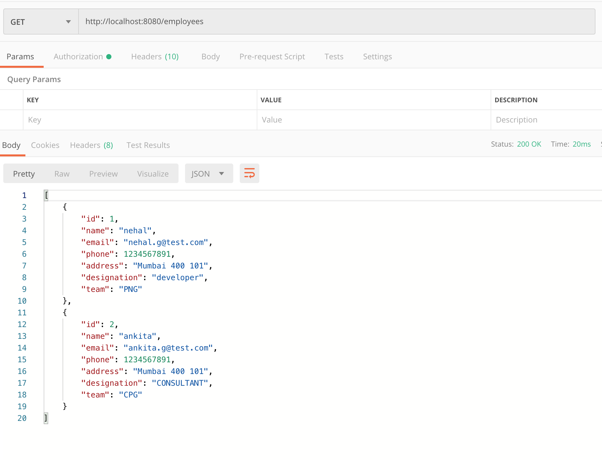
    - Futher we want to search the employee by email or name or both we will have to pass query params to this route.
    - Output:
    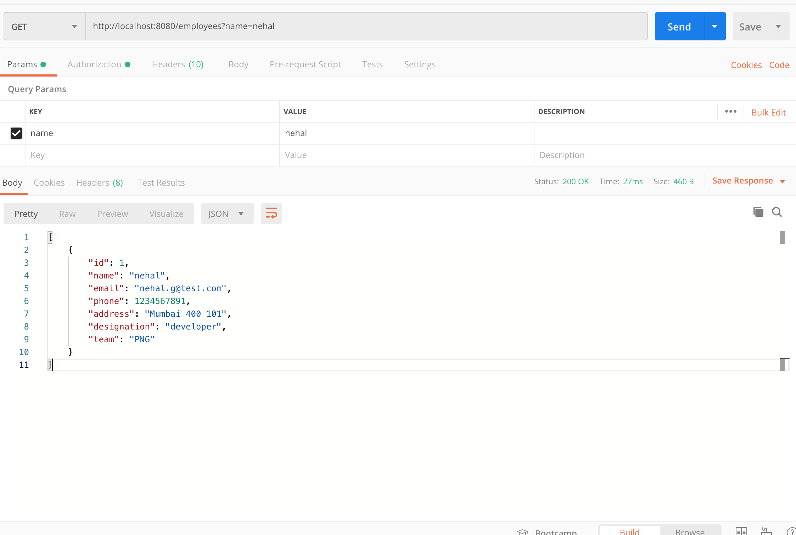
    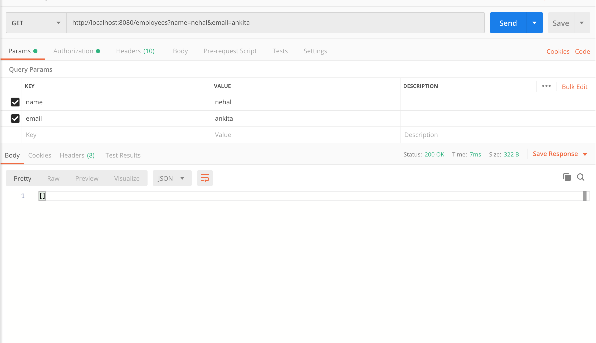
    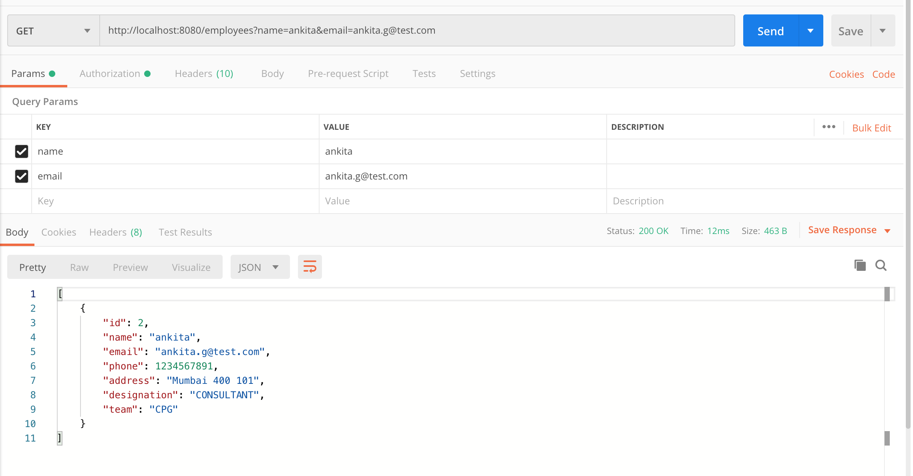
- GET: /employees/{id} : Will get a employee by id
    - Example - /employees/2
    - This API will get a employee by ID. In the above example the API will get the employee whose id is 2
    - Output:
    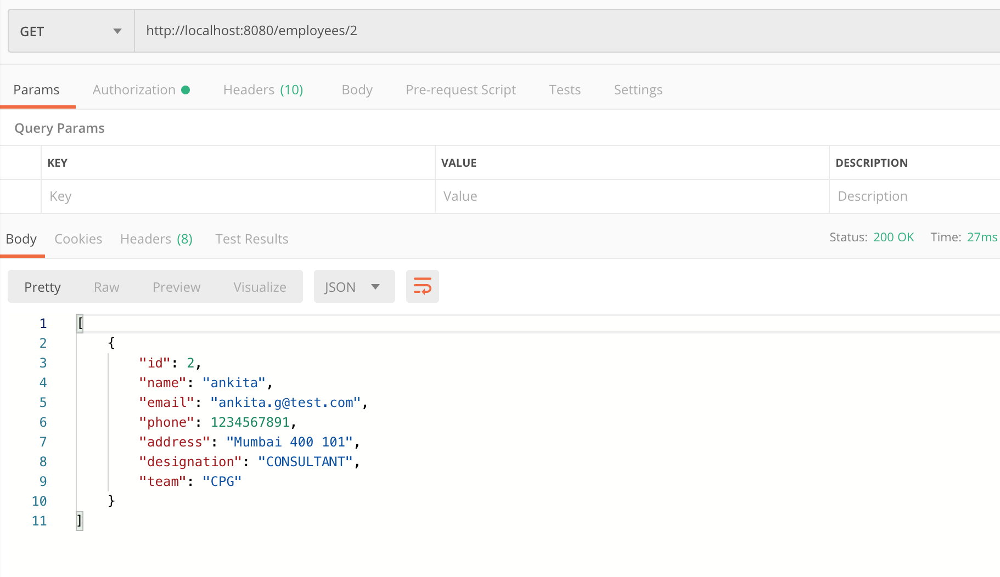
- POST : /employees : Creates a employee
    - This end point will validate the employee data and if the data is valid it will save the data in the database. 
    - If the data is valid, it will return the data that was created at the backend which contains the id of that record
    - If the data is not valid, it will send relevant HTTP status code along with the error message
    - Output:
    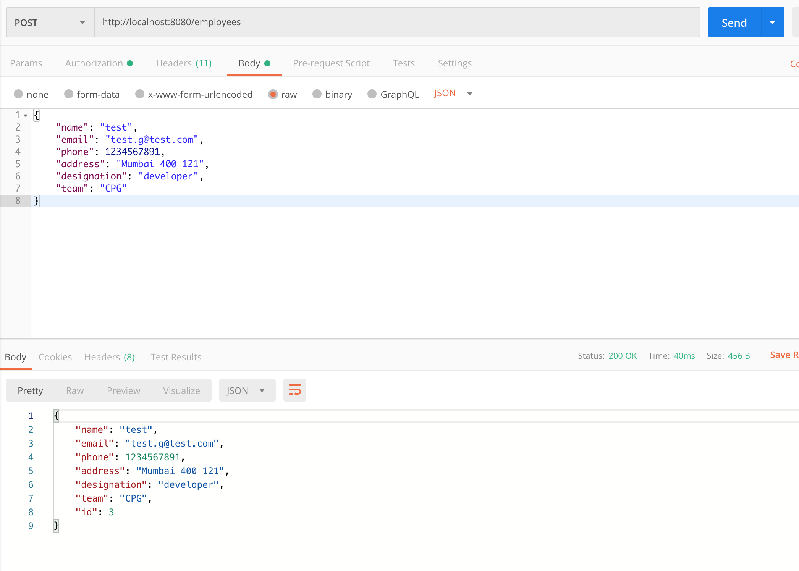
    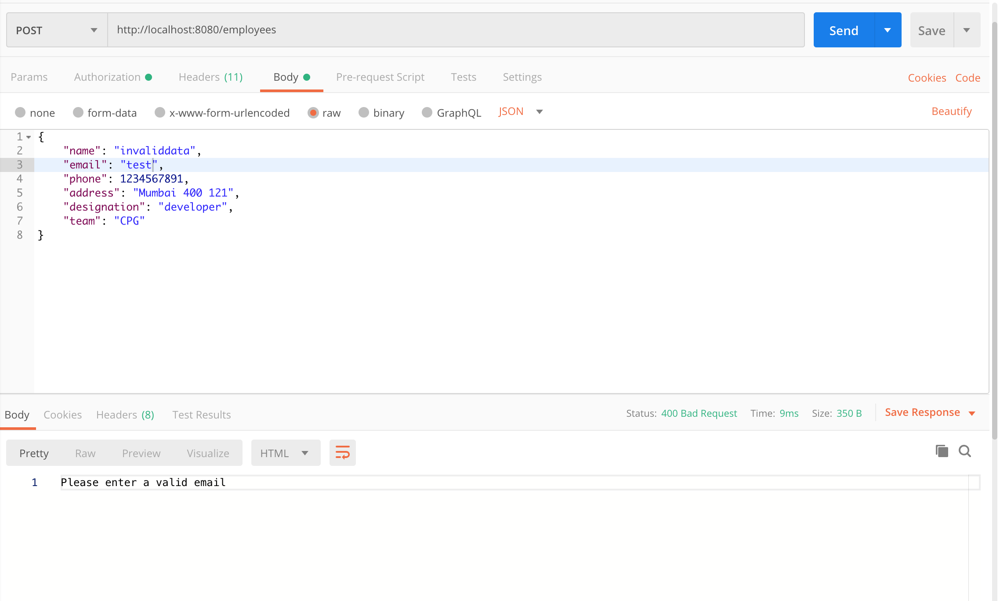
    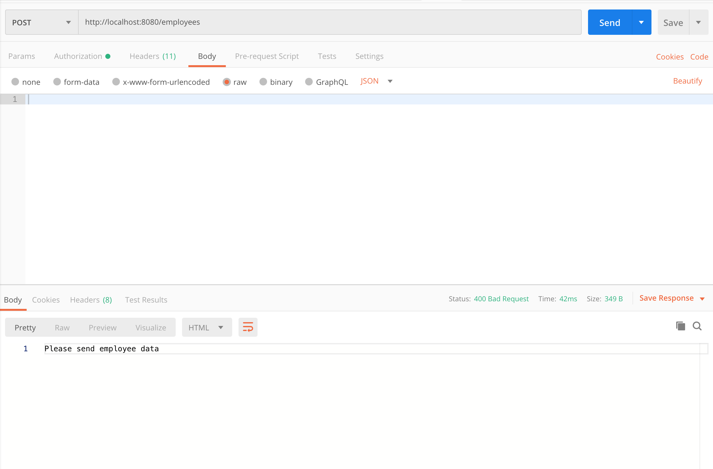
    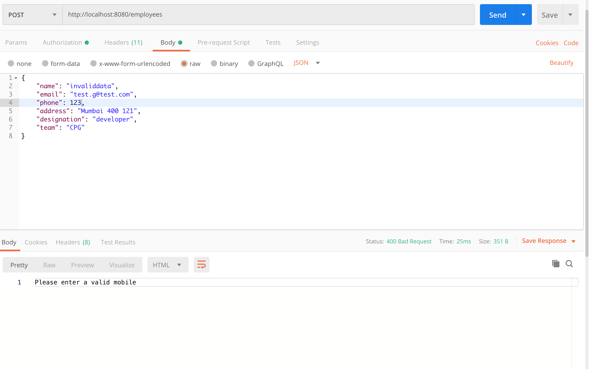
- PUT: /employees/{id} : Updates a employee by id
    - Example: /employees/2
    - This end point will validate the employee data and if the data is valid, it will update the data in the database corresponding to that id.
    - If the data is valid, it will return the updated data
    - If the data is not valid, it will send relevant HTTP status code along with the error message
    - Output:
    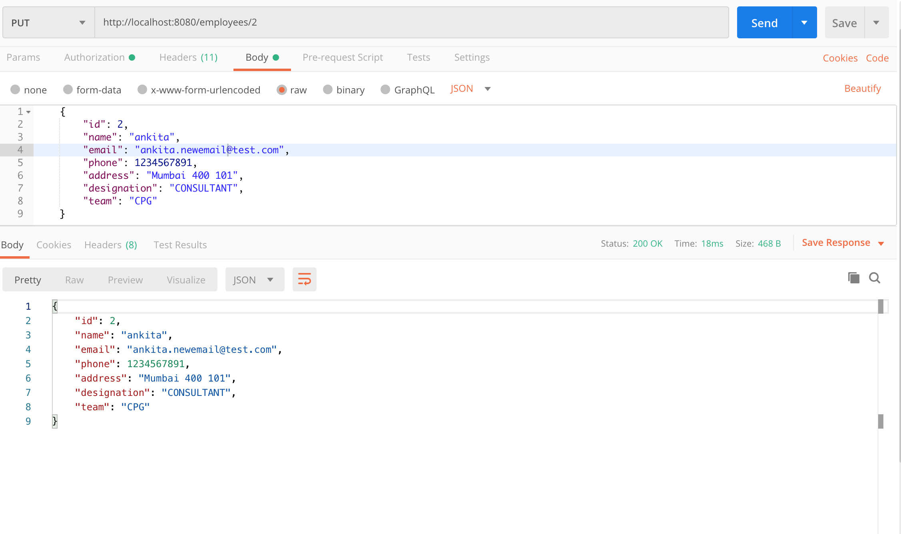
    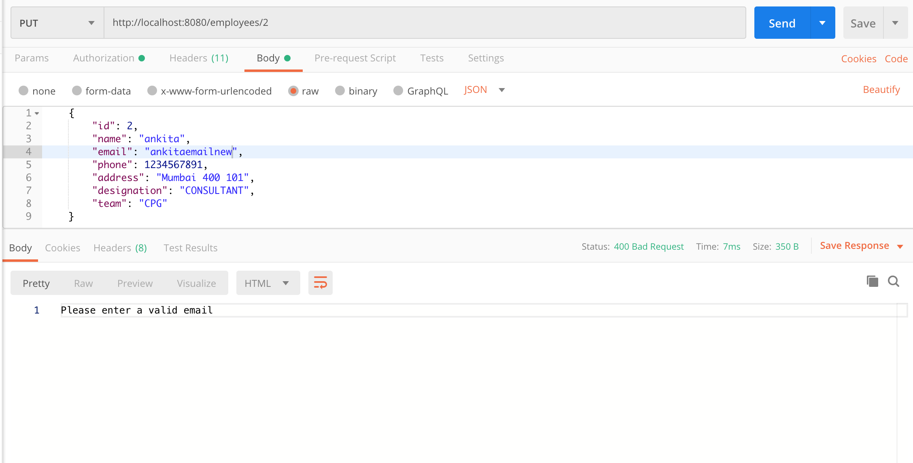
    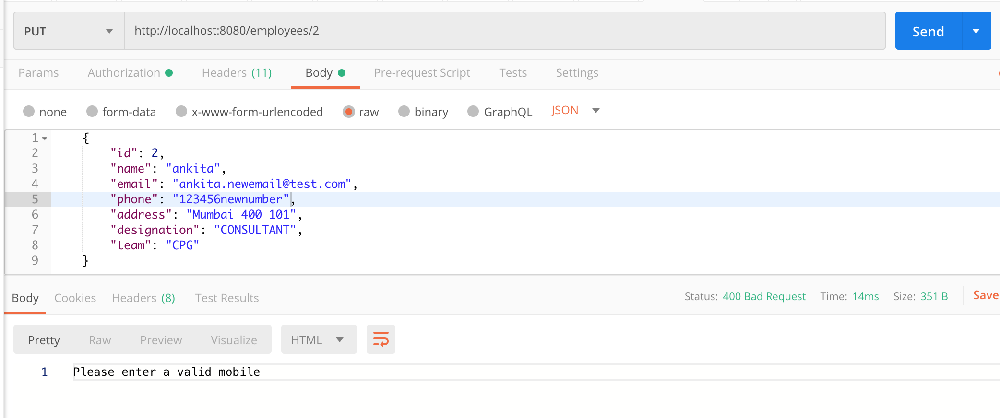
- DELETE: /employees/{id} : Removes a employee by ID
    - Example: /employees/2
    - In the above example the API will delete the employee whose id is 2    
    - Output:
    
    After the data is removed the new employees list
    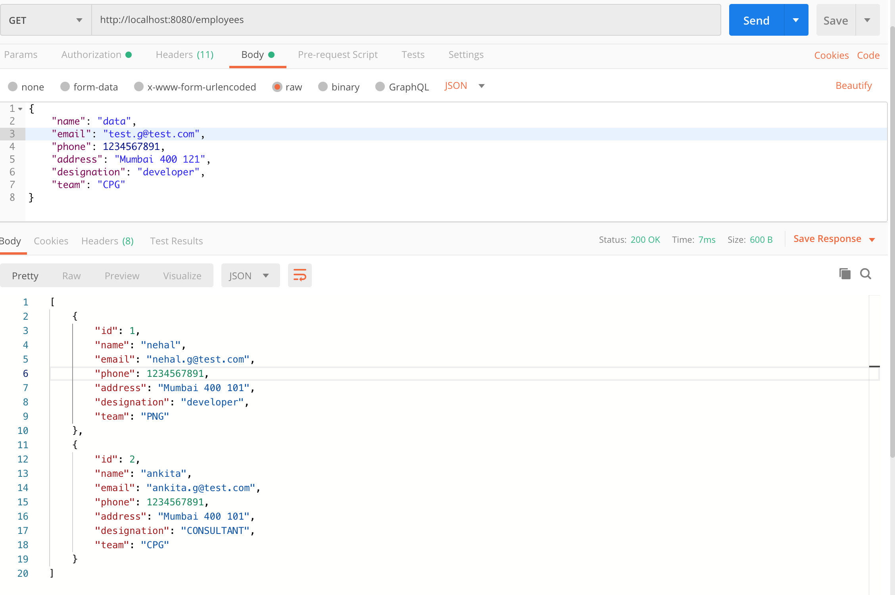