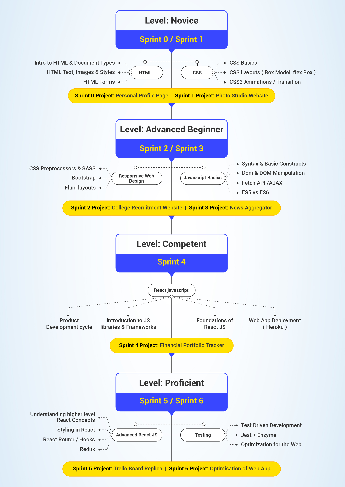

# Learning Path

Following is a Front End Journey roadmap highlighting the tech stack you will learn, the projects that you will build and the expertise you will gain

## Sprint 0: Prep Work

**Overview**

This is where it all begins! A hands-on introduction to all of the essential tools you'll need to build real, working websites. 

Begin your first step in becoming a front end developer. Familiarize yourself with Basics of Web Development, HTML & CSS

**Learning Outcomes**

After this sprint, you will have an understanding of

- How does web work?
- What is web development?
- What are the different web development roles?
- What are the different web technologies?
- What is the role of HTML & CSS in a web page?
- How to structure a page using HTML?
- How to format/style a page using CSS?

**Associated Concepts:**

***Concept 1:*** [Foundations of Web Dev](sprint_0/1.%20Foundations%20of%20Web%20Dev)

***Concept 2:*** [Foundations of HTML](sprint_0/2.%20Foundations%20of%20HTML)

***Concept 3:*** [Introduction to CSS](sprint_0/3.%20Introduction%20to%20CSS)

**Project:** [Create a Personal Portfolio Page](sprint_0/4.%20Project)

## Sprint 1: Foundations of Web Development
### Overview
In this sprint, you'll spend a good deal of time getting familiar with the major client-side (browser-based) languages like HTML and CSS. You will also learn about design and UI principles which will help you create user-friendly web pages.

### Learning Outcomes
After this sprint, you will have an understanding of
- What is the role of HTML in a web page?
- What is the role of CSS in a web page?
- Principles of visual design
- How to design a simple web page using HTML and CSS

### Prerequisites
Completion of Sprint 0

### Associated Concepts
***Concept 1:***  [Basics of HTML](https://github.com/greyatom-school/the-minerva-project/tree/master/FEWD/sprint_1/1.Basics_of_HTML)

***Concept 2:***  [Basics of CSS](https://github.com/greyatom-school/the-minerva-project/tree/master/FEWD/sprint_1/2.Basics_of_CSS)

### Project
- [ARK Studio](https://github.com/greyatom-school/the-minerva-project/tree/master/FEWD/sprint_1/project)

## Sprint 2: Responsive Web Design

### Overview
Nowadays, almost 60% of the online content is consumed on a mobile device, hence it is essential for a web developer to design a product that would give optimal experience on these mobile devices. Responsive design is an approach to web page creation that makes use of flexible layouts, flexible images, and cascading style sheet media queries. The goal of responsive design is to build web pages that detect the visitor's screen size and orientation and change the layout accordingly. In this sprint, you will learn about CSS preprocessors and frameworks to simplify CSS workflows.

### Learning Outcomes
After this sprint, you will have an understanding of
- Advantages of using CSS Preprocessors
- Optimize CSS using preprocessors
- Bootstrap CSS framework
- How to create fluid layouts
- Creating responsive web pages using Bootstrap

### Associated Concepts
***Concept 1:***  [Basics of rwd](https://github.com/greyatom-school/the-minerva-project/tree/master/FEWD/sprint_2/1.Basics_of_rwd)

***Concept 2:*** [CSS Preprocessors](https://github.com/greyatom-school/the-minerva-project/tree/master/FEWD/sprint_2/2.CSS_preprocessor)

***Concept 3:*** [Bootstrap](https://github.com/greyatom-school/the-minerva-project/tree/master/FEWD/sprint_2/3.Bootstrap)

### Project
[Zomato Landing Page](https://github.com/greyatom-school/the-minerva-project/blob/master/FEWD/sprint_2/project/project.md)

## Sprint 3: Foundations of JavaScript

### Overview
Make your websites dynamic and interactive with JavaScript! You'll create features and stand-alone applications. This course will wrap everything you've learned at The Odin Project into one, final capstone project.

### Learning Outcomes
After this sprint, you will have an understanding of
- Basics of programming - Variables, control statements, object-oriented programming, data structures
- Basics of DOM and DOM Manipulation
- ES5 vs ES6
- Advanced Javascript
- DOM Events and AJAX

### Concepts
***Concept 1:***  [Basics of Javascript Programming](https://github.com/greyatom-school/the-minerva-project/tree/master/FEWD/sprint_3/1.Basics%20of%20Javascript%20programming)

***Concept 2:***  [Ajax and DOM Events](https://github.com/greyatom-school/the-minerva-project/tree/master/FEWD/sprint_3/2.%20Ajax%20and%20DOM%20Events)

***Concept 3:***  [Advance Javascript Concept](https://github.com/greyatom-school/the-minerva-project/tree/master/FEWD/sprint_3/3.%20Advance%20Javascript%20concepts)

### Project
[News Aggregator App](https://github.com/greyatom-school/the-minerva-project/blob/master/FEWD/sprint_3/project/project.md)

## Sprint 4: Development Workflow & React JS

**Overview**

The previous sprint introduced you to the world of JS programming which promises reusable components, simplified coding and unbelievable rendering performances. In this sprint, we will deep-dive into Web development methodologies and ReactJS. 

We will understand how exactly does ReactJS simplify the life of front-end developers 

**Learning Outcomes**

After this sprint, you will have an understanding of

- Entire Web Development Life Cycle

- What are JS libraries and frameworks? Why use them?
- Why React?
- Foundations of ReactJS
- Deploying web apps on the world wide web

**Associated Concepts:**

***Concept 1:*** [End to End Development Workflow](sprint_4/1.%20End%20to%20end%20development%20workflow)

***Concept 2:*** [Introduction to ReactJS](sprint4/2.%20Introduction%20to%20ReactJS)

***Concept 3:*** [Foundations of ReactJS](sprint_4/3.%20Foundations%20of%20ReactJS)

***Concept 4:*** [Foundations of ReactJS](sprint_4/4.%20Deployment%20of%20web%20apps)

**Project:** [Create a Financial Portfolio Tracker](sprint_4/5.%20Project)

## Sprint 5: Advanced React
### Overview
In this sprint, you will dive deeper into JSX, and get introduced to the React ecosystem by getting hands-on with React Router and Redux.

### Learning Outcomes
After this sprint, you will have an understanding of
- Using CSS in React
- Accessibility
- Error Boundaries
- Forwarding Refs
- Fragments
- Higher-Order Components
- Integrating with Other Libraries
- Optimizing Performance
- Portals
- Reconciliation
- Refs and the DOM
- Render Props
- Static Type Checking
- Strict Mode
- Uncontrolled Components
- Why use a Router?
- Why use Redux?

### Concepts

## Sprint 6: Testing and optimizing your web apps
### Overview
Now that you are creating full-fledged web apps it is time to test your apps and optimize them for the worldwide web. The main aim of Frontend testing to make sure that every user is well-protected from bugs. Creating a frontend testing plan helps you to know the devices, browsers, and systems that your project needs to cover.

### Learning Outcomes
After this sprint, you will have an understanding of
- Need for testing
- Different types of testing
- Unit testing using JEST
- Test Driven Development
- Optimizing your product for the web

### Concepts

