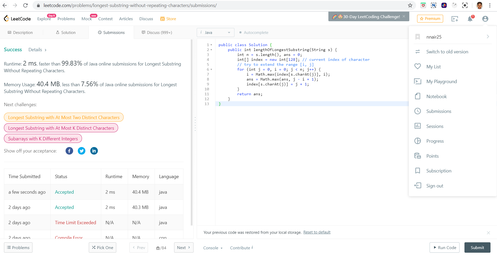

# How to submit answers

Follow the step by step procedure to correctly submit the answers to the quiz.

Step 1:
Create an account at [LeetCode](https://leetcode.com/). It's required to attempt the coding challenges there.

Step 2:
Go through the questions given in the [curated path](addlink) one by one and attempt to solve it.

Step 3:
After solving the required questions, submit the screenshot relevant to the question.

For eg: 
For the question : [Longest Substring without repeating characters](https://leetcode.com/problems/longest-substring-without-repeating-characters/)

You have to take a similar screenshot and submit it:

- Things to keep in mind when posting the screenshot:
    1. Ensure that you show your profile bar to verify it's indeed your solution. You can display it by clicking on the top right of the page.
    
        Reference image:
        
    
    2. Ensure that your solution is completely visible and not hidden by your profile bar(See the main screenshot's solution code block for reference)

    3. Ensure you take the screenshot after `"successfully submitting"` the code i.e. your left pane should have submission status

        Reference image:
        

    4. Ensure that in the screenshot the question URL is visible as it contains details of the question(See the main screenshot's adress bar for reference)

After ensuring the above criteria are met you can submit the screenshot image to the google form sheet associated with the appropriate question.

