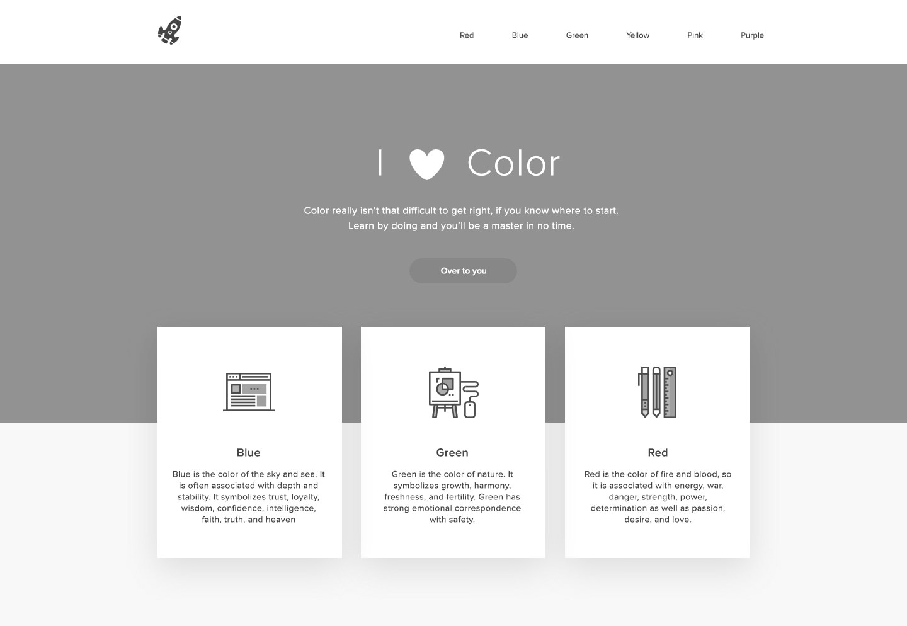

## CSS Assignment: Write CSS for HTML Structure created previously

### Problem Statement

As you can see below, this is the same mock up we used to build our HTML structure. It's time to style it.

Write the CSS for the HTML structure you created for this mock up.

Placeholder images have been provided for the images you see in the first Mock up. Use one of them as logo.

Add a state transition on hovering over the button.

The grayscale colors is `#929292` and `#919191`.

### Sample Input

UI mock up

### Sample Output

Apply CSS to HTML Structure

### Constraints

- Use external css file to style the elements
- Use flex box for setting the layout
- There is a slight shadow on the color boxes seen on top of the banner. Figure out how to provide shadows on the box. It's easy ;)
