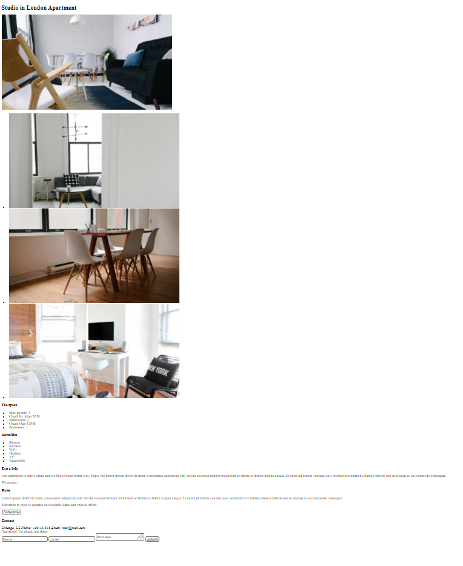

# Sprint 1 - Foundations of HTML & CSS

## Overview

In the previous sprint, you have already learned some basics of HTML and CSS. In this sprint, you'll learn the advance concepts of HTML and CSS. 

We will understand the importance of HTML and CSS in front-end developer's life.

## Pre requisites

- You just need mindset that everything you are learning is important in your front-end developer journey

- You must have gone trough the sprint 0

## Learning outcomes

After this sprint, you will have understanding of 

- What is Web Development?
- What are the different divisions of Web Development?
- What is HTML?
- What is CSS?
- What is HTML5 and CSS3?
- How to structure a Webpage?
- How to set up the layout of a web page?
- How to animate elements with CSS3 animations?

### What will you build?

At the end of html module you will be able to build basic html page

At the end of css module you should be able to build good looking css page

- Sprint project: ARK studio

At the end of this project you should be able to build ARK Studio landing page.

# Associated Concepts

**Basics of HTML (BH)**

- [Introduction to HTML & Document Types, Elements, Tags & Attributes](basics_of_html/1.Intro%20to%20HTML.md)
- [HTML Texts, Images and Styles](basics_of_html/2.%20HTML%20Texts%2C%20Images%20and%20Styles.md)
- [HTML Lists](basics_of_html/3.HTML%20Lists.md)
- [HTML Tables](basics_of_html/4.%20HTML%20Tables.md)
- [HTML Forms](basics_of_html/5.%20HTML%20Forms.md)
- [HTML5 & Features](basics_of_html/6.%20HTML5%20%26%20Features.md)
- Assessment Quiz
- Assignment

**Basics of CSS (BC)**

- [Introduction to CSS, Selectors, Properties & Values](basics_of_css/1.%20Intro%20to%20CSS.md)
- [CSS Box Model & Sizing](basics_of_css/2.%20CSS%20Box%20Model%20%26%20Sizing.md)
- [CSS Colors, Text formatting, Background and Lists](basics_of_css/3.%20CSS%20Colors%2C%20Text%20formatting%2C%20Background%20and%20Lists.md)
- [CSS Scrollbars, Visibility & Display](basics_of_css/4.%20CSS%20Scrollbars%2C%20Visibility%20%26%20Display.md)
- [CSS Layout & Positioning](basics_of_css/5.%20CSS%20Layout%20and%20Positioning.md)
- [CSS3 Flexbox](basics_of_css/6.%20CSS%20Flexbox.md)
- [CSS3 Transition, Transformation and Gradient](basics_of_css/7.%20CSS3%20Transition%2C%20Transformation%20and%20Gradient.md)
- [CSS3 Animations](basics_of_css/8.%20CSS3%20Animations.md)
- Assessment Quiz
- Assignment

## Projects on GitHub

- [https://github.com/whatwg/html](https://github.com/whatwg/html)
- [https://github.com/h5bp/html5-boilerplate](https://github.com/h5bp/html5-boilerplate)
- [https://github.com/remy/html5demos](https://github.com/remy/html5demos)
- [https://github.com/murtaugh/HTML5-Reset](https://github.com/murtaugh/HTML5-Reset)
- [https://github.com/html5rocks/www.html5rocks.com](https://github.com/html5rocks/www.html5rocks.com)
- [https://github.com/kristoferjoseph/flexboxgrid](https://github.com/kristoferjoseph/flexboxgrid)
- [https://github.com/miniMAC/magic](https://github.com/miniMAC/magic)
- [https://github.com/LeaVerou/css3patterns](https://github.com/LeaVerou/css3patterns)
- [https://github.com/necolas/css3-social-signin-buttons](https://github.com/necolas/css3-social-signin-buttons)
- [https://github.com/sawmac/CSS3](https://github.com/sawmac/CSS3)
- [https://github.com/Elitewares/CSS3-Slider](https://github.com/Elitewares/CSS3-Slider)
- [https://github.com/daneden/animate.css/](https://github.com/daneden/animate.css/)

