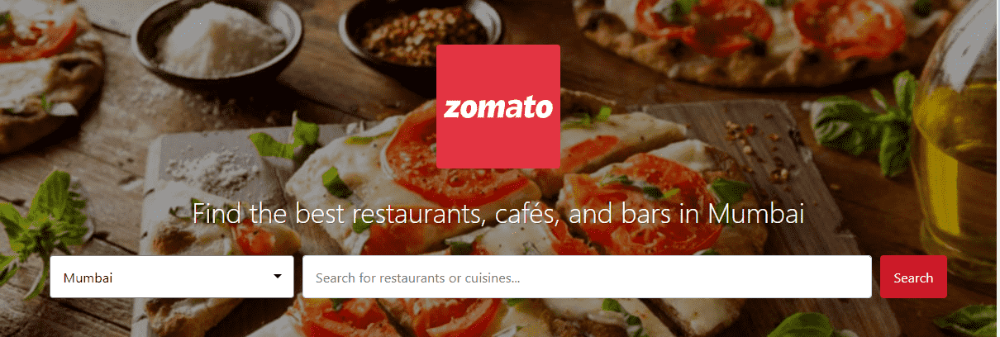
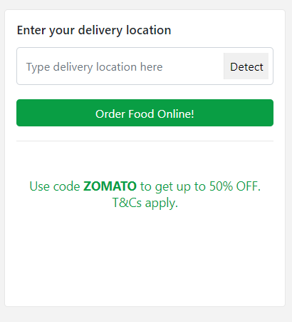
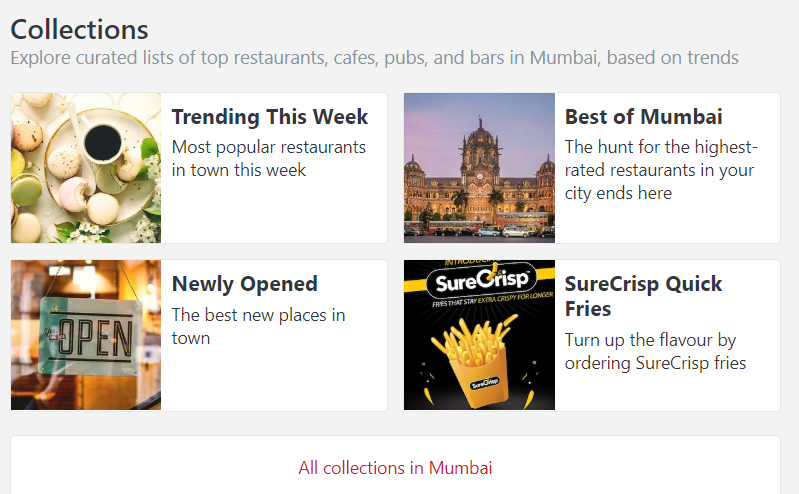
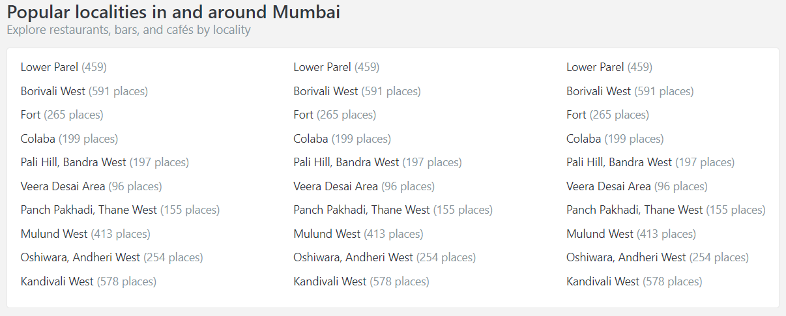
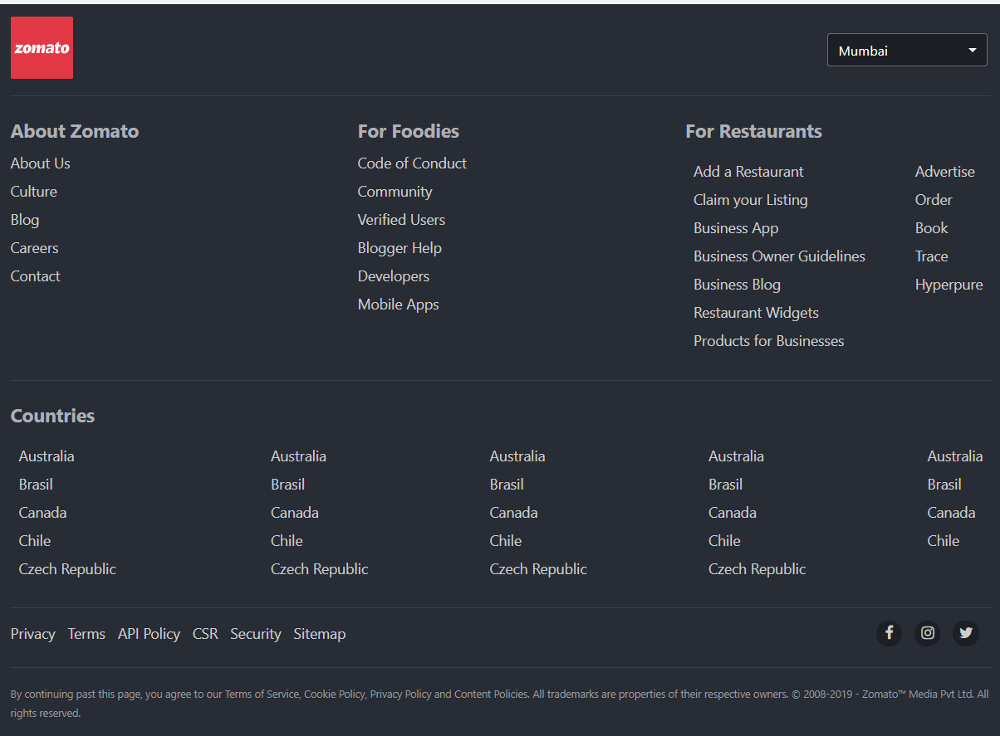

## Assignment: Zomato Landing Page

### Problem Statement

You are working for Zomato and your stakeholders expect you to build the landing page of the application.

The images are provided to you in the boilerplate repo and you will get once you start the project on GLabs. 

|Normal View|Responsive View|
|--|--|
|||

### Note: 
All the elements that you have to build must satisfy the following conditions:

- They should be responsive
- The styling should be as close to Zomato Page as possible

## User Story 1:

User should have website navigation bar to help him traverse the website

*Reference image:*

#### Details :

- Create a `header` with class name `"header-container"`
- Inside header create `div`
- The `div` should have three `li` items. 
	- The list items should be `<a>` elements with the ids: `"nav_item_1"`,`"nav_item_2"`,`"nav_item_3"`
	
	- The `<a>` should have the link text: "Order Food", "Book a Table" & "Zomato Gold" (mapped in the same order i.e. nav_item_1 has text `"Order Food"`, nav_item_2 has text `"Book a Table"` and so on and so forth)

- Add a `"Get the app"` link to the left of the above `li` items

- Add a `"Log in"`/`"Create an account"` link below the `header"`

- Add remaining CSS styling of your choice

---

## User Story 2:

User should have search option to find the restaurants in town.

*Reference image:*

#### Details :

- Create a `section` with class name `"banner"` and inside the section create `div` with class name `"search-restaurant"`. 
	- Inside the `div` create `input` element with id `"search-res"` where `type= "text"` and `placeholder= "Search for restaurants or cuisines..."`

- Add a `button` for search with class `"search-btn"` and display text `"Search"`

- Add Zomato logo above the search bar/button with the text `"Find the best restaurants, cafés, and bars in Mumbai"`

- Add CSS styling of your choice

## User Story 3:

User should have access to order a food on their prime location.

*Reference image:*

#### Details :

- Create a `div` with class `widget`. Add the following things inside the `div`	
	- Add `h4` heading `Enter your delivery location`
    - Create `input` element with class name `"search-del"` where `type= "text"` and  `placeholder= "Type delivery location here"`
	- Add a `button` for search with class `"detect-btn"` and display text `"Detect"`
	- Add another button for ordering with class=`"order-btn"` and display text `"Order Food Online!"` 

- Add allignment of your choice(Preferred- left of the screen)
- Below the `widget`, add the text `"Use code ZOMATO to get up to 50% OFF. T&Cs apply."` 

- Add CSS styling of your choice
- Add a "Collections" component on the right side of your 	`widget` personalied based on your city(Optional)

*Reference image ('Collections' components):*

	
## User Story 4:

User should have access to quick searches based on food type.

# *Reference image:*

#### Details :

- Create a `section` with class name `"categories"`

- Inside the `section`,
	- Create a `h2` element with id `"cat-title"` and text `"Quick Searches"`
	- Create a `p` element with id `"cat-subtitle"`
	and text `"Discover restaurants by type of meal"`

	- Create an unordered list(`ul`) with id `"category-list"` that has eight children `li` items
	
	- `li` items are `img` elements with the associated texts-
	 `Delivery`, `Pocket-Friendly Delivery`, `Breakfast`, `Lunch`, `Dinner`, `Drinks & Nightlife`, `Cafes` and `Desserts & Bakes` respectively. 

- Add CSS styling of your choice 

## User Story 5: 

User should have understanding of popular localities in and around <u>`your location`</u>.

*Reference image:*

#### Details :

- Create a section with class name `localities`

- Inside the `section`,
	- Create a `h2` element with id `"loc-title"` and text `"Popular localities in and around "` + `"Your location"`
	
	
	- Create a `p` element with id `"loc-subtitle"`
	and text `"Explore restaurants, bars, and cafés by locality"`

	- Inside the section, create an unordered list `ul` with class name `"locality-list'` and atleast ten list items mentioning nearby places. 

- Add CSS styling of your choice 

## User Story 6:

User should have footer widget with `About Zomato` , `For Foodies` and `For Restaurant` information.

*Reference image:*

#### Details :

- Create a `footer` element and inside footer, create `div` with class name `"footer-wrapper"` 

- Inside `div` element add the list items("About Zomato", "For Foodies", "For Restaurants", "Countries")

- Add a zomato logo and list of cities on top of the footer.
