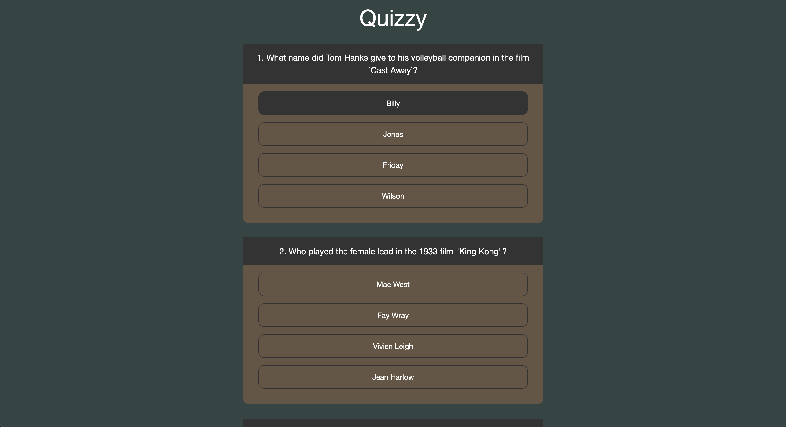

## Overview

This concept will help you understand events, event loops and event delegation.

At the end of the topic, you'll be able to select the answers from the list of options that you have rendered for a quiz question. Attaching an image for reference:

## Learning Outcome

- What is a JS event?
- What is an event loop?
- What is event delegation?

### Events

JavaScript's interaction with HTML is handled through events that occur when the user or the browser manipulates a page.

When the page loads, it is called an event. When the user clicks a button, that click too is an event. Other examples include events like pressing any key, closing a window, resizing a window, etc.

Developers can use these events to execute JavaScript coded responses, which cause buttons to close windows, messages to be displayed to users, data to be validated, and virtually any other type of response imaginable.

Events are a part of the Document Object Model (DOM) Level 3 and every HTML element contains a set of events which can trigger JavaScript Code.

#### What you must do?

- Go through the [examples](https://www.w3schools.com/js/js_events_examples.asp) to learn about various events.
- Read about [JS event listener](https://www.w3schools.com/js/js_htmldom_eventlistener.asp). Using this, you do not have explicitly define the event in html tags. Instead you can do it within your JS code.

### Event loop

The **event loop** is the secret behind JavaScript’s asynchronous programming. JS executes all operations on a single thread, but using a few smart data structures, it gives us the illusion of multi-threading.

#### What you must do?

- The event loop is the secret behind JavaScript’s asynchronous programming. JS executes all operations on a single thread, but using a few smart data structures, it gives us the illusion of multi-threading. Answer to [what the heck is the event loop anyway?](https://www.educative.io/edpresso/what-is-an-event-loop-in-javascript?affiliate_id=5082902844932096&utm_source=google&utm_medium=cpc&utm_campaign=platform2&utm_content=ad-1-dynamic&gclid=Cj0KCQjw9fntBRCGARIsAGjFq5EnMmG7ayfF6tcqw07zQZ1fxn5qliwuA8F3v94zcT1kS1jzmYAU-IkaAtOdEALw_wcB)
- The window object allows execution of code at specified time intervals. These time intervals are called timing events. Read about [JS timing events](https://www.w3schools.com/js/js_timing.asp)

### Event Delegation

Event delegation allows you to avoid adding event listeners to specific element like `
`; instead, the event listener is added to one parent. That event listener analyzes bubbled events to find a match on child elements.

#### What you must do?

- What if you have a clickable area within a clickable area? How can you make sure both are appropriately clicked? Read about [Event Propagation](https://www.kirupa.com/html5/event_capturing_bubbling_javascript.htm) which will help you in handling the event bubbling and propogation.

### Additional References

This section contains some additional helpful links.

- What is [event loop concurrency?](https://www.applozic.com/blog/javascript%E2%80%8A-%E2%80%8Aevent-loop-concurrency/) In this article we will try to figure out how event loop and concurrency actually works in javascript.

* Whats the difference between [JS event delegation, bubbling and capturing?](https://gomakethings.com/whats-the-difference-between-javascript-event-delegation-bubbling-and-capturing/)
* Handle JS events efficiently with [bubble and capture](https://dev.to/shimphillip/handing-javascript-events-efficiently-with-bubble-and-capture-4ha5)

## Coding Practice

### Task 

Show a stylised list of 10 quiz questions. Style it as per your creativity. Make sure you add some elements of delight like hover effect, animation on selecting an answer, etc. to brush your knowledge on CSS animation.

### Input

API call that provides 10 quiz questions

### Output

Retrieve the list and render the questions and answers

### Constraints

- API call should be made using `fetch()` api
- Use jQuery for DOM manipulation

