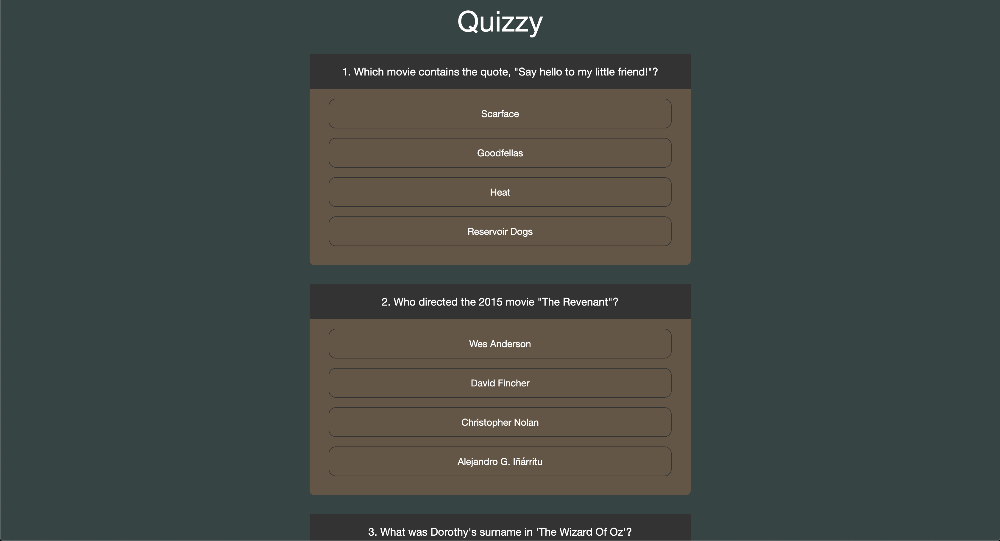

# Sprint 3 - Foundations of JavaScript

Congratulations on completing Sprint 2! In sprint 3, you'll learn how to make your websites dynamic and interactive with JavaScript!

## Overview

This course path will guide you in learning basic to advanced JavaScript. You'll solve problems, build features and create a stand-alone web application.

### What will you learn?

After this sprint, you will have an understanding of

- What is JavaScript?
- Why do you need to learn Javascript?
- What are the core features of JavaScript?
- What are the advanced features of JavaScript?
- How to make API calls to server in JavaScript?
- What is ECMAScript 6 and how can you use it to build modern application?
- What are some common libraries being used in JavaScript?

### What will you build?

You will be building a standalone app to show the latest news and search for news based on news search.

You'd also build a quiz app by displaying questions with options for user to provide an answer.

### Learning Outcomes

After this sprint, you will have an understanding of

**Basics of JS programming (BJSP)**

- Variables and Data types
- Operators
- Control flow
- Error handling
- Functions
- Object-oriented programming
- Data structures
- Basics of DOM and DOM Manipulation
- Assignment

**AJAX (Promises) & DOM Events (ADE)**

- Using external libraries like jQuery, Lodash.
- Fetch or HTTP request
- Event loop - Synchronous and asynchronous
- ES6 - Async await
- Event delegation, propagation, bubbling
- Best Practices
- Assignment

**Advanced Javascript Concepts (AJC)**

- Advanced data structure - arrays, objects (react specific topics)
- How ES6 works - Babel
- This keyword
- Arrow functions
- Template literal
- Let and const
- Import, export modules
- Default parameters
- Hashmap (optional)
- Inheritance
- Other environments like NodeJS (npm), YARN
- Best Practices
- Assignment

## Content Tree

<table>
  <tr>
    <th>Sprint</th>
    <th>Concept</th>
    <th>Topic</th>
    <th>Quiz (Yes/No)</th>
    <th>Difficulty Level</th>
    <th>Estimated Time</th>
  </tr>
  <tr>
    <td rowspan="32">Sprint 3: Foundations of JavaScript</td>
    <td rowspan="8">Basics of JS programming</td>
    <td>Introduction to JS: Variables and Operators</td>
    <td>Yes</td>
    <td>Easy</td>
    <td>1 hour</td>
  </tr>
  <tr>
    <td>Control Flow &amp; Error Handling</td>
    <td>Yes</td>
    <td>Easy</td>
    <td>2 hours</td>
  </tr>
  <tr>
    <td>Functions &amp; Object Oriented Programming</td>
    <td>Yes</td>
    <td>Medium</td>
    <td>2 hours</td>
  </tr>
  <tr>
    <td>Data Structures</td>
    <td>Yes</td>
    <td>Medium</td>
    <td>2 hours</td>
  </tr>
  <tr>
    <td>Basics of DOM and DOM manipulation/Debugging</td>
    <td>Yes</td>
    <td>Medium</td>
    <td>3 hours</td>
  </tr>
  <tr>
    <td>Form Validation</td>
    <td>Yes</td>
    <td>Medium</td>
    <td>1 hour</td>
  </tr>
  <tr>
    <td>Assessment concept quiz</td>
    <td></td>
    <td>Easy</td>
    <td>20 min</td>
  </tr>
  <tr>
    <td>Assignment: Remove Duplicates</td>
    <td></td>
    <td>Medium</td>
    <td>1 hour</td>
  </tr>
  <tr>
    <td colspan="5"></td>
  </tr>
    <tr>
    <td>Using external libraries and best practices</td>
    <td>Yes</td>
    <td>Medium</td>
    <td>1 hour</td>
  </tr>
  <tr>
    <td rowspan="6">AJAX, Promises & DOM Events</td>
    <td>REST/AJAX/Promises/Fetch</td>
    <td>Yes</td>
    <td>High</td>
    <td>3 hour</td>
  </tr>
  <tr>
    <td>Event loop &amp; Event delegation</td>
    <td>Yes</td>
    <td>High</td>
    <td>1 hour</td>
  </tr>
  <tr>
    <td>Assessment concept quiz</td>
    <td></td>
    <td></td>
    <td>20 min</td>
  </tr>
  <tr>
    <td>Assignment: Quiz Creator Project</td>
    <td></td>
    <td></td>
    <td>2 hour</td>
  </tr>
  <tr>
    <td colspan="5"></td>
  </tr>
  <tr>
    <td rowspan="8">Advanced JS Concepts</td>
    <td>Advanced Data Structure</td>
    <td>Yes</td>
    <td>High</td>
    <td>1 hour</td>
  </tr>
  <tr>
    <td>ECMAScript 6</td>
    <td>Yes</td>
    <td>Medium</td>
    <td>3 hour</td>
  </tr>
  <tr>
    <td>Inheritance &amp; 'this' keyword</td>
    <td>Yes</td>
    <td>High</td>
    <td>1 hour</td>
  </tr>
  <tr>
    <td>Storage</td>
    <td>Yes</td>
    <td>Easy</td>
    <td>1 hour</td>
  </tr>
  <tr>
    <td>Package managers</td>
    <td>Yes</td>
    <td>Easy</td>
    <td>1 hour</td>
  </tr>
  <tr>
    <td>Assessment concept quiz</td>
    <td></td>
    <td></td>
    <td>20 min</td>
  </tr>
  <tr>
    <td>Assignment: Image Slider</td>
    <td></td>
    <td></td>
    <td>2 hour</td>
  </tr>
  <tr>
    <td colspan="5"></td>
  </tr>
  <tr>
    <td rowspan="5">News Aggregator</td>
    <td>Readiness Checklist</td>
    <td rowspan="5"></td>
    <td rowspan="5">Medium</td>
    <td rowspan="5">8 hours</td>
  </tr>
  <tr>
    <td>Project Overview</td>
  </tr>
  <tr>
    <td>Screen Mockups</td>
  </tr>
  <tr>
    <td>Boiler plate &amp; Assets</td>
  </tr>
  <tr>
    <td>User Stories Board</td>
  </tr>
  <tr>
    <td colspan="5"></td>
  </tr>
  <tr>
    <td colspan="3"></td>
    <td>Total</td>
    <td>46 hours</td>
  </tr>
</table>

## Projects on GitHub

- [https://github.com/sudheerj/awesome-javascript-technologies](https://github.com/sudheerj/awesome-javascript-technologies)
- [https://github.com/gordonnl/animatejs](https://github.com/gordonnl/animatejs)
- [https://github.com/codrops](https://github.com/codrops)
- [https://github.com/addyosmani/es6-tools#readme](https://github.com/addyosmani/es6-tools#readme)
- [https://github.com/EbookFoundation/free-programming-books](https://github.com/EbookFoundation/free-programming-books)
- [https://github.com/freeCodeCamp/freeCodeCamp](https://github.com/freeCodeCamp/freeCodeCamp)
- [https://github.com/nefe/You-Dont-Need-jQuery](https://github.com/nefe/You-Dont-Need-jQuery)
- [https://github.com/public-apis/public-apis](https://github.com/public-apis/public-apis)

All the best! :)
