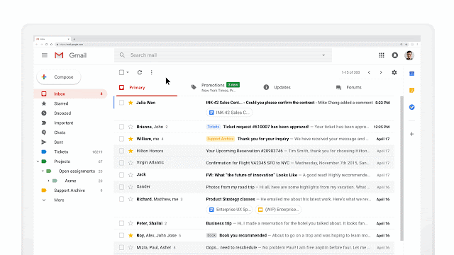

# Single Page Applications (SPAs)

## Overview

The new-age web applications don’t require reloading of pages.
Popular apps like Gmail and Facebook are examples of that.

In apps like that what happens is that JavaScript intercepts the browser events and instead of making a new request to the server, the client requests some JSON or performs an action on the serve. The page that the user sees never completely goes away, and behaves very similar to a desktop application.

These applications are known as Single Page Applications (SPAs). 

**ReactJS is a SPA framework**

In this topic, let's understand what exactly a SPA is.

## Learning Outcome

-	What are Single Page Applications?

-	How are SPAs different from traditional Multi-page Applications?

-	Why are SPAs better?

-	Examples of SPA

## Introduction

Traditional web pages like the one you made in earlier sprints consisted of multiple pages(Multipage application-MPA).

 By multiple pages, we mean to say that clicking on some HTML DOM element (not limited to anchor tag elements) would result in reloading the page and opening a new HTML file.
 
For examlpe, consider the [ADCI solutions website](https://www.adcisolutions.com/)

While the differentiation of the files was a good structure, reloading the page would involve a fresh download of resources and added waiting time depending on the network speed.

In stark contrast, Single Page Applications(SPAs) have only one HTML file and the content is updated on the DOM tree without having to reload the entire page. This saves a lot of network bandwidth and resources.

What you must do?

-	Understand the major [differences between between SPA and MPA](https://medium.com/@NeotericEU/single-page-application-vs-multiple-page-application-2591588efe58) 

- Read and appreciate [why SPA is so efficient](https://blog.angular-university.io/why-a-single-page-application-what-are-the-benefits-what-is-a-spa/)(and currently the preferred method by web developers). 

## Assessment Quiz

1.	Which of the following are advantages of Single Page Applications?

a.	HTML+CSS+JS pages are loaded multiple times throughout the lifespan of application.

b.	Caching local storage is very efficient. [Correct answer]

c.	It is very easy to maintain SEO for the application.

d.	Multiple levels of UI are involved.

2.	It is easier to make a mobile application with SPA. – True or false?

a.	True. [Correct answer]

b.	False.

3.	Any amount of client frameworks added to the SPA will not affect the speed to download its resources. – True or false?

a.	True.

b.	False. [Correct answer]

4.	Single Page Applications are safer than traditional websites. – True or false?

a.	True.

b.	False. [Correct answer]

5.	Which of the following are NOT the advantages of MPA?

a.	It’s perfect for users who need a visual map of where to go.

b.	It’s very good for SEO management.

c.	Its resources need not be downloaded for every page render. [Correct answer]

d.	It’s an excellent choice for websites with multiple levels of UI.

