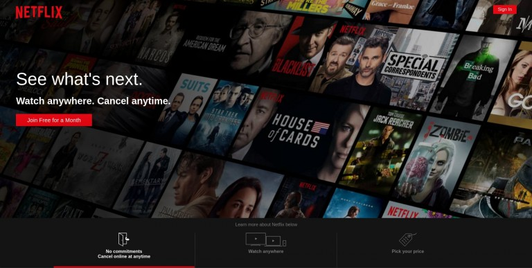
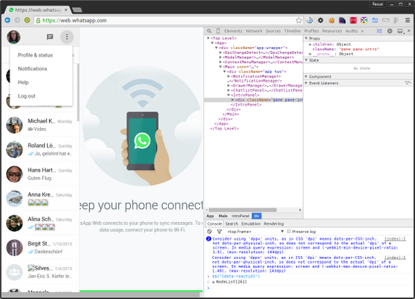

# Introduction to ReactJS

## Overview

After having a thorough understanding of various front-end technologies, we have finally arrived at ReactJS

ReactJS framework is currently being used by internet giants including:

## Netflix

## Whatsapp

## Instagram

And so many more....

Let's start with the introduction to ReactJS

## Learning Outcome

-	What is ReactJS?

-	Why is it the most preferred library for front-end development?

-	How does ReactJS function?

## Introduction

In the previous topic, we saw how the introduction of Single Page Applications resolved the unnecessary download of resources involved in traditional Multi Page Applications. While AngularJS led from the front in the SPA revolution, it’s steep learning curve and data binding for updating the DOM was still resented by a vast majority of the front-end development community.

That’s when Facebook Inc. developed a light-weight library called ReactJS which inclines towards component reusability, east data flow and virtual DOM creation(The terms might be confusing now but they will be clear soon)  

## What you must do?

-	Read and understand [what is ReactJS and why should we use ReactJS?](https://codeburst.io/what-is-reactjs-and-how-can-make-your-life-easier-3beb797f30e4)

- Explore the [six core features of React](https://www.credencys.com/blog/unveil-key-features-of-react-js-for-web-mobile-app-development/) by reading this article's **Features of React JS** section.

-	Next, understand a little more about [ReactJS features which makes it quicker, lighter and more efficient](https://hackernoon.com/virtual-dom-in-reactjs-43a3fdb1d130) than most of the front-end frameworks.

## Additional Resources

-	Read the official documentation of ReactJS and know about why [Facebook decided to create ReactJS framework](https://reactjs.org/blog/2013/06/05/why-react.html) 

-	Also, read [why ReactJS is gaining so much popularity in the front-end web development community](https://medium.com/@thinkwik/why-reactjs-is-gaining-so-much-popularity-these-days-c3aa686ec0b3) 

Assessment Quiz

1.	Which of the following is NOT true for ReactJS?

a.	It uses the Virtual DOM concept for efficient rendering.

b.	Data flow is complicated between different pages and elements. [Correct answer]

c.	ReactJS is SEO friendly.

d.	React extensively uses reusable components.

2.	React is the ____ equivalent of an MVC architecture.

a.	Model.

b.	View. [Correct answer]

c.	Controller.

3.	If something hasn’t finished loading, other components in React will not load. – True or False?

a.	True.

b.	False. [Correct answer]

4.	If the parent state has changes, ReactJS will re-render all the children. – True or False?

a.	True. [Correct answer]

b.	False.

5.	If an element is changed from 
 to <article>, the entire DOM tree will be destroyed and reconstructed. – True or False?

a.	True. [Correct answer]

b.	False.
