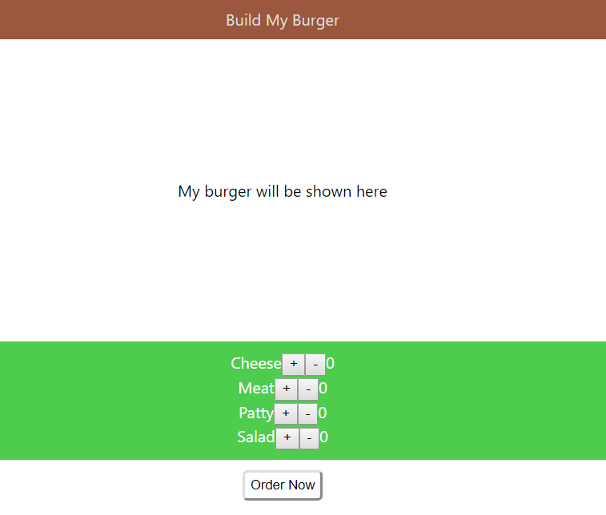
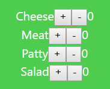

# Event Handling in React

## Overview

One of the primary reasons why web developers prefer React is because of its efficiency to update the DOM quickly.

 For that reason, it’s imperative for us to have a good understanding of how to handle the reactivity, i.e. events in React.

In this topic, we learn how to handle DOM events in React.

We will also try to create an 'ingredient counter' for 'My Burger' project using the knowledge of States and Event Handling

|Full View|Ingredient Counter View|
|---|---|
|||


## Learning Outcome

 
-	Handle events in React.

-	Find out the difference between handling events in DOM vs React.

-	Avoid common mistakes while handling events in React.

## What you must do?

As we learned previously, event handling is basically the interaction that the user has with the web page. Event handling in React is fairly similar to how it is done in JavaScript. Perhaps, the only minor few changes are that of syntax. If you still face problems with event handling in JavaScript, kindly go through the event handling sessions in the previous sprint before moving forward here.

-	Read and understand a good gist of [how to handle events in React](https://reactjs.org/docs/handling-events.html) 

-	Next, understand [how to avoid common 'event handling' mistakes made by new React developers](https://upmostly.com/tutorials/react-onclick-event-handling-with-examples)

## Assessment Quiz

1.	You can return false to prevent default behavior in React. – True or False?

a.	True.

b.	False. [Correct answer]


2.	Which of the following is the correct method of naming React events?

a.	`button_clicked();`

b.	`button-clicked();`

c.	`buttonClicked();` [Correct answer]

d.	`ButtonClicked();`


3.	Which of the following statement is FALSE?

a.	e.preventDefault() is called explicitly for preventing default behavior in React.

b.	Class methods in React are not bound by default.

c.	

```jsx
<button onClick={() => functionName}>Click me!</button> is correct.
```  
[Correct answer]

d.	You can call multiple functions inside a click handler in React.


4.	What is the correct syntax for calling a click handler function defined inside a component from an onClick event, after the button is clicked?

a.
```jsx	
<button onClick={clickHandler}>Click</button>`
```
b.	
```jsx
<button click={this.clickHandler()}>Click</button>`
```
c.	
```jsx
<button onClick={this.clickHandler()}>Click</button>`
```
d.	
```jsx
<button onClick={this.clickHandler}>Click</button>
```
[Correct answer]


5.	What will happen if this syntax is executed - 

```jsx
<button onClick={this.clickHandler()}>Click me</button>`?
```
a.	The function clickHandler will be called after the button is clicked.

b.	The function clickHandler will not be called at all.

c.	The function clickHandler will be called on the first render only. [Correct answer]

d.	The function clickHandler will be called once on render and once after the button is clicked.

## Coding practice

In this practice assignment, we will continue with our burger project. We will create a counter next to the ingredients you had created in the 'Build My Burger App' so far. 


Basically, every individual counter will show the number of that particular ingredient that the user wishes to add to the final burger. For example, if the counter next to cheese is 2, it basically means we will be adding 2 slices of cheese to the burger. If the counter next to vegetable patty is 1, then we will be adding 1 vegetable patty to the burger.

To achieve that, complete the following tasks:

-	In the 'Ingredients' component, add two buttons next to the ingredient name. One button should have the plus symbol (+) and the other one should have the minus symbol (-).


-	Next, create an object in the state which stores the values of the number of ingredients. (Hint: the object should have four keys with each of the ingredients name and a default value 0 initialized against it.)

-	After this, create a text element next to the buttons in step 1 which should show the value of the counter of that particular ingredient. This value should correspond to the one in state.

-	On clicking ‘ + ’, the value of the state should increase and simultaneously, the increased value should be shown in the text next to the buttons on UI. Similarly, for ‘ - ‘, it should be vice-versa.

|Before|After|
|---|---|
|||