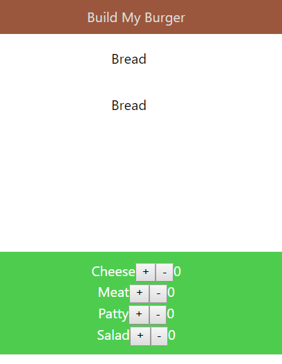
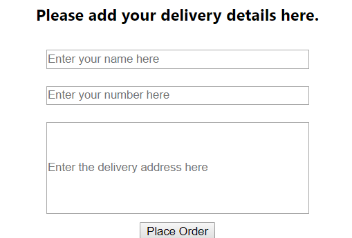

# Assignment

In this assignment, you will make further additions and final changes to the 'Build My Burger App' that you have been creating.

Complete the following tasks:

1.	We had left an empty space in the center for dynamically creating burger elements. Using the concepts taught to you in add equivalent number of ingredient text in that empty space. Two breads text will always be there.

For example, initially all the counters are zero. So, the center will look something like this:

If the user clicks once on salad counter, the center will get updated to:
 

Similarly, if the user clicks twice on cheese in addition to the above, it will look like:
  

2.	Create a form inside the modal which currently shows the user’s order details. The form should be a controlled component and it should ask for:

    1. User’s name

    2. Contact number

    3. Delivery Address

Make sure you use PropTypes for validation.

Add another button at the end of the modal which shows ‘Place Order’. 

On clicking of this button, the modal should close and a message should be shown that the order is placed.     

## Assignment Submission Details