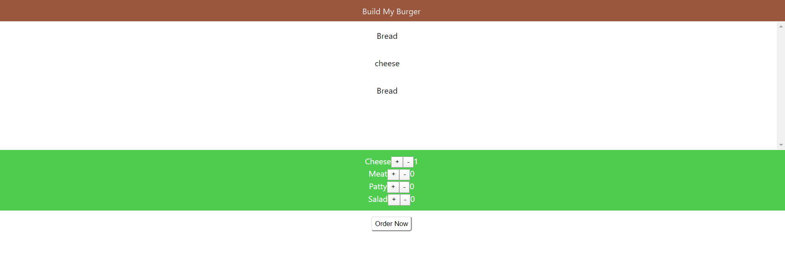

# **Accessibility in React**

## Overview

In this session, we will understand how to create React websites that can be used by everyone, irrespective of their language, machine or accessories used and disabilities.

## Learning Outcome

•	What is Web Accessibility and why is it crucial for any website?

•	How can you achieve Web Accessibility for React applications?

•	What are the different practices and standards to be followed for accessibility in React?  

## Accessibility in React

To better understand accessibility, let's imagine all the users of our web application to be desktop users who don't use the mouse for interacting with the website. Given that they don't have a mouse, they will be using keyboard for traversing the website. 

For instance, they will be using the <kbd>Tab</kbd> key for moving from one element to another, like moving from a bread's <kbd>+</kbd> counter to <kbd>-</kbd> counter or moving from the burger ingredients section to the <kbd>Order Now</kbd> button. 

Now what if your React application doesn't support that on clicking <kbd>Tab</kbd>, it should move from the <kbd>+</kbd> to <kbd>-</kbd> button? Quite evidently, the users will not just be frustrated, they will probably never return back to using your React application.

This is the reason why understanding Accessibility - the principles behind ensuring that every user not limited to technology, disability or language should be able to use a web application. 

## What you must do?

•	Read the [official React documentation on Accessibility](https://reactjs.org/docs/accessibility.html) till More Complex Widgets. You can skip the various hyperlinks mentioned inside the sections. 

## Additional Resources

•	Save [this handy cheat sheet](https://www.wuhcag.com/wcag-checklist/) for WCAG (Web Content Accessibility Guidelines) standards to be used while creating web pages. 

## Coding Assignment

In our 'Build My Burger' application(Sprint 4 Coding assessment), using the principles of accessibility that you have just learnt, make the following changes:

- Set the language of the web application right at the beginning of our web app.
- Use React fragments where we are rendering lists in the application.
- Use labels in the form elements that you have created for placing an order.
- Ensure that <kbd>Tab</kbd> button functions properly on your web application from every element.

If you are stuck in between, you can refer to the complete solution of the project [here](https://drive.google.com/file/d/1BiFcjVIviF3ZGB25ax00dAbd7PBjwpvb/view?usp=sharing)

