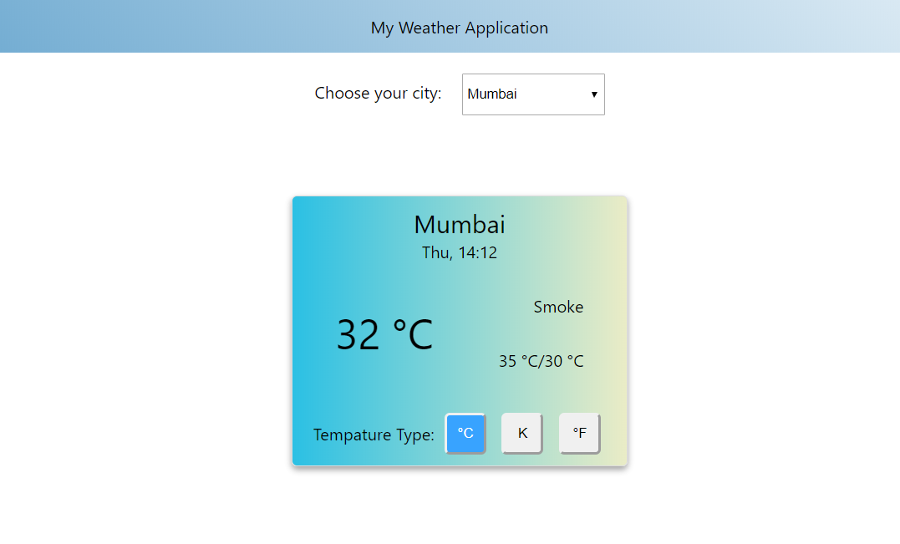
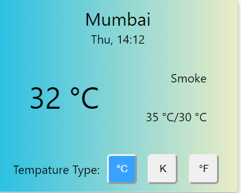

# **Assignment**

In this assignment, you will use the principles of CSS Modules and everything you have learnt in this concept to style the Weather Application.



You need to do the following:

1. Use ```npm run eject``` to eject your CRA configuration and install CSS Modules.

2. Use gradients to give a background-color to the navigation header. You can either replicate the navigation header shown in the diagram below or create your own gradient.

-  

3. Add date and time to the city text.

4. Move the temperature and the row containing min/max and temperature type into a single row. Look at the diagram for reference.

5. The background color of the card should be changed according to the time of the day. If it's day-time (anytime before 7 PM), the background color of the card should be reflecting a light theme, similar to what is shown in the diagram. If it's night time (after 7 PM), the card should show a dark background. 


6. Make sure the web application looks professional in terms of design and colors. Ensure the individual elements like buttons, dropdowns and the rest of the elements are properly styled.


If you are stuck in between, you can refer to the complete solution of the project [here](https://drive.google.com/file/d/1BiFcjVIviF3ZGB25ax00dAbd7PBjwpvb/view?usp=sharing)

