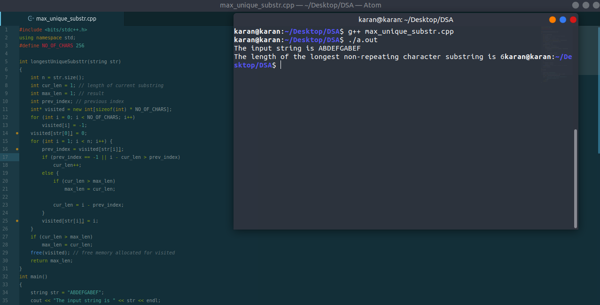

# How to submit answers

Follow the step by step procedure to correctly submit the answers to the coding questions.

Step 1: 
Read the problem carefully. You will see that each problem is followed by a code block listing the input to be sent and the output expected. 

Step 2: 
Use the sample as a reference an figure out an algorithm to solve the problem. 

Step 3: 
Implement the algorithm in an IDE of your choice or a text editor and execute it passing the inputs provided in the codeblock. Take a screenshot such that both the code written by you and the output is visible. Check out the figure below as reference. 
 

Step 4: 
Repeat this for all the questions.

Step 5: 
Once you have all the screenshots, click on the Google Form link at the end of your assessment.

Step 6: 
In the Google Form, upload the screenshots.

Step 7: 
For each question, you will find that the Form also has a few MCQs to test your algorithmic thinking. Attempt them carefully as you will also be evaluated on them.

Step 8: 
After you upload the screenshots and answer all the question, make a folder of all your codes and create a zip file. Upload the zip file in the last question of the form before submitting.
