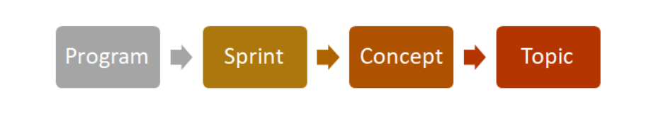
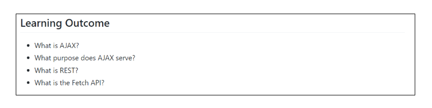
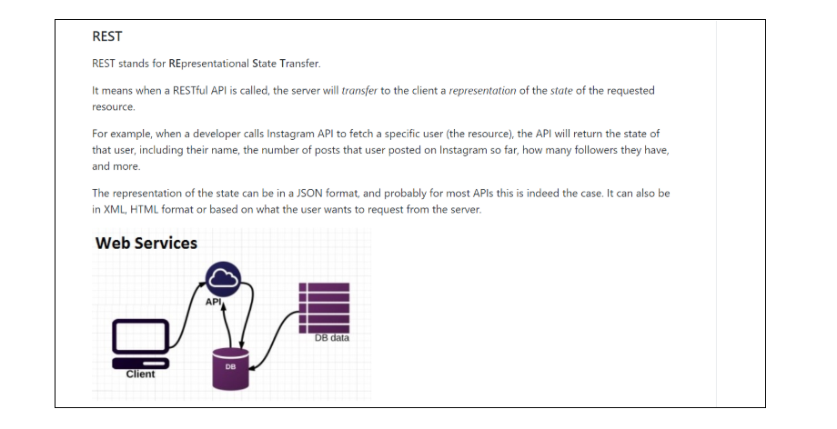
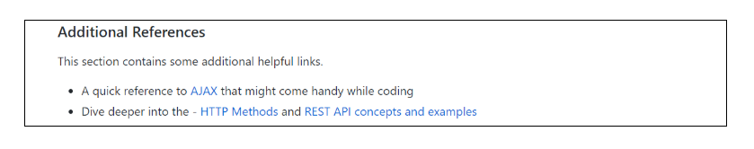
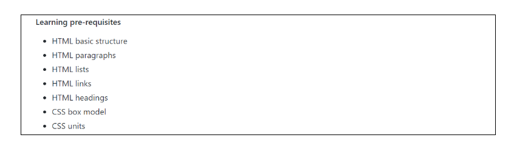
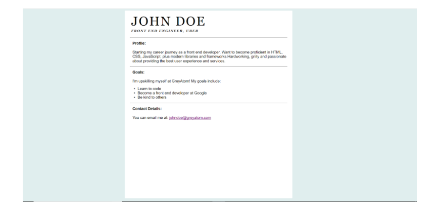
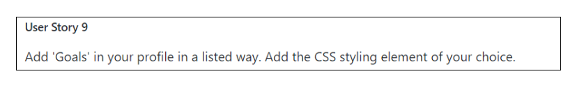

# Learning Paths At GreyAtom - Mission Statement

Our main focus is the cultivation and sequencing of the best free resources around the internet. We believe wholeheartedly that everything one needs to know to become employed can be found for free online. However, for the average new learner, the vast quantity (and widely varying quality) of resources makes it difficult to make meaningful progress. Therefore, we have devised three basic steps to fix this.

## Meaningful Learning Path

We have information overload. We can watch speakers any time, and, in more places than not, it’s free! We need the interaction, the engagement, and the experience. We can Google anything. We can find infographics on anything. We can find case studies on anything. We can find blog, vlogs, podcasts, tweets, and sometimes snapchats on anything. It’s called the Internet.
We don’t have a content problem; we have a filter problem, an aggregation problem. We must filter that content through the context of whom we’re trying to connect with and teach.
Content is what we’re pouring into people. Context is everything that makes those people unique.
We have created a curriculum that attempts to find the optimal sequencing of information. This curriculum is intended to take someone from knowing literally nothing about web development to a point where they could be employed as a Junior Developer.
For each topic in the curriculum, we try to find the best free resources on the internet that teach that topic. We will often link multiple resources so as to not rely too much on a single source of information. If good resources cannot be found, we write our own, but we prefer primary links to external sites.

## Work on real problems
We invent and cultivate projects that give learners a chance to practice what they have learned and to integrate skills along the way. These projects increase information retention, give the learner a chance to experiment, and allow the learner to build an impressive portfolio.

## OpenSource Content
Additionally, we have made our learning materials completely open source. This means that if anyone comes across a resource that is better than what is currently included in our lessons, that person is free (and encouraged!) to add them, which improves our curriculum over time and helps it to stay up to date.
   

## Learning with a Tribe

People learn with small tribe of their own - a small group of equally motivated learners. We strike the hard balance between large-group instruction and give people smaller chambers of interaction for on-boarding applied sciences. Peer learning is highly encouraged with the first channel of help always being routed to the peers. 

Research also indicates that peer learning activities typically yield very good results for both mentor and mentee: team-building spirit and more supportive relationships; greater psychological well-being, social competence, communication skills and self-esteem; and higher achievement and greater productivity in terms of enhanced learning outcomes. Reference: [How Peer Teaching Improves Student Learning and 10 Ways To Encourage It](https://www.opencolleges.edu.au/informed/features/peer-teaching/)

Moreover self-learning requires quite a bit of discipline and can be frustrating at times especially when stuck. Thus, having a good support system in the form of peers and a mentor helps to stay on track while learning. 

## Interventions with Tribe Leader - Mentor

Mentorship has been known to be effective in bridging the knowledge gap and understanding the use of emerging technologies for business. An ideal mentor would be someone who has a working knowledge of emerging technologies and has actually solved business problems using them. These mentors are best placed to guide aspiring learners on the path to upskilling into niche emerging technologies. Mentors hold learners accountable for their learning goals, help learners grow and share practical knowledge that they have accumulated over years of practice. They also advice the learners on how to build their portfolio such that they stand out from the rest of the crowd. Our data says that mentorship improves learning outcomes by almost 5 times! 

With the flipped model, learners come prepared with the content to the sessions, and the learning that happens in those sessions is a level up from traditional learning. With a lot of focus on problem solving instead of just onboarding, learners accumulate skills that actually help them in their professional careers. 

 Let's now dive into the basic principles of instructional design to keep in mind while building self-paced content for the learners. 

# Content Curation Process
The content building process can be broken up into the following phases 

CC corresponds to the content creator while GA corresponds to GreyAtom. Let’s look at each of the phases in detail.

## 1. Research
Before you get into the details of creating your concept, take some time (30 minutes or so) to think about the following areas and write down your answers. Use those answers to guide the rest of your planning and content creation; they can save you a lot of time in the end.

- Define the problem statement and the high-level goal of the concept 
- Identify your audience.
- What do you think should have already been covered before? Do you have any dependencies with other concepts in terms of what you want to onboard?
- Define the course learning objectives.

Eventually, you will spend much more than 30 minutes planning and thinking about each of these areas. But the areas are not independent of each other. For right now, the idea is to think about all of the major areas once, briefly and at a high level, so that when you get into the details for each area, you have the start of a global plan in place.

Some of the good practices while researching for a concept
- Look at other tutorials/blogs which cover the concept and understand what do they do well and what they don’t. 
- Make a note of what is done well and try to do more of that. 
- Also, make a note of what is not done well and try to avoid the same or rectify in the concept that you are about to build. 

## 2. Build an outline - Concept Tree

The first step before building out the content is building out a complete outline of what you wish to cover and a hierarchical breakup. 
- List the key topics to be onboarded with this concept and the criticality of each one. 
- Define the problem you want learners to solve as part of this course, mention in your comments, why this problem is best suited for the concept
- Review the concept outline with the GreyAtom Program team and freeze the outline. This is an important checkpoint for both the creator and GreyAtom to be on the same page w.r.t the content that needs to be made. 

For each concept, the chapters along with topics in each chapter and whether the topics contain hands-on tasks or not. Initially, you might not have an idea of the exact tasks to be placed. But a high level idea of where to put the tasks is a good place to start and iteratively you can build them out. 

## 3. Review
**Internal GA review**

GA would provide the feedback via github issues. 
For every feedback regarding the content, the GA team will create a github issue. Once the feedback is incorporated, the content creator can mark the issue as resolved along with an acknowledgement that the feedback is locked in.

In case, the content creator feels that the feedback cannot be incorporated, the content creator can comment on the issue - why the feedback won’t be incorporated.

**External Expert review**

Post the feedback incorporation of GA, the concept will then be sent to an external expert who is outside the content creation process to get an impartial view of the content.
The expert also locks in the review via bitbucket issues and the resolution process is the same as with the content team.
## 4. Deploy
 GA team will deploy the content into platform and share access with you, so that you can look at how the content looks in end state.

## 5. Beta Test

Even after all the reviews, the real feedback for content comes from beta testing. Early user testing has given us some fantastic feedback . We will open up the content to 25 learners who will consume it before the course becomes globally live and share the feedback. 

# Curating Content - The complete journey

We will discuss how to actually curate the content for GreyAtom. These procedures are distilled from the best practices and success we have seen from earlier programs.  

## Content Hierarchy

Before you start curating the content, it is important to understand the content hierarchy. The hierarchy of content as defined from the top to bottom is as follows:

**Program**

A program is top most element of the content hierarchy. A program typically lasts 4-6 months depending on the modules that are defined within the module. 
Ex: Front End Web Development

**Sprint**

The next logical entity in the program. A sprint contains a set of concepts that together make up an important component of the program. A sprint is planned for a period of two weeks with an estimated time to be spent as 16hours. A sprint consists of learning units and projects.

Ex: 

Program: Front End Web Development
- Sprint: Foundations of JavaScript 

**Concept**

At the end of learning a particular concept, the learner should acquire a tangible skill which is demonstrable. 

Ex: 

Program: Front End Web Development 
- Sprint: Foundations of JavaScript 
    - Concepts: 
        - Basics of Javascript Programming
        - Ajax & DOM 
        -  Advanced Javascript Concepts

**Topic/ Learning Units**

Inside each concept, there are topics which is the actual consumable unit for learners.
It consists of the curated content that learners have to go in a prescriptive way.

Following is a visual representation of hierarchy mentioned:

---
---
After Content Creator(CC) understands the hierarchy, following are the content deliverables:

- Sprint Content Tree
- Sprint Topics
- Sprint Project

## Sprint Content Tree

The first step during creation of sprint is to identify the content tree. Content tree is a hierarchical breakdown of sprint into concepts/ project and then into topics.

Creation of Content Tree provides two benefits:
Gives CC overall a better clarity on their content curation journey
Helps GA get a bird’s eye view of the content expected to be curated

Following is an example of content tree:

As mentioned before, creation of content tree consists of identifying the concepts associated with the sprints as well as breakdown of the concepts into topics/project.

Additionally, after the topic curation[to be discussed later],CC will also fill in the additional columns of the content tree

- *Quiz(Yes/No) - Whether the topic has a quiz*
- *Difficulty Level - The level of difficulty associated while learning the topic(Easy, Medium, Hard)*
- *Estimated Time(hrs)- The time estimate for the topic completion by the learner(in hours)*

## Sprint Topic

After creation of content tree, the next step is to create topics. 

The topic consists of the following structure:
- Overview
- Learning Outcome
- Introduction
- What you must do
- Additional References
- Topic Quiz
- Concept Quiz

Let’s look at them one by one(with the example topic:  Rest, ajax promises & fetch)

***Overview:***

A couple of sentences explaining what they will learn in the topic

***Learning Outcome:***

An extension of overview. The learning outcome consists of questions that the learner will be able to answer after they go through the topic

***Introduction:***

This consists of giving the learners a brief 1-2 paragraph introduction of the subtopic.
 
While going through the curated content, the learner might feel overwhelmed. It’s important therefore that they familiarise themselves with the topic before exploring

***What you must do:***

This is where the curated content is presented in a prescriptive way for learners.

Following can be the different types of curated content

- Topic blog   

It primarily consists of providing topic blogs that are required to be completed by the learner to have an understanding of the concept. 

- Video Tutorial

Video tutorials consisting of explanation via code walkthrough which learner has to watch and code along with for understanding of the topic

- Self paced code exercises

These are small coding assignment / challenges in form of embeddable code pane which a learner has to complete is order to have hands-on experience of topics learnt. 

*Note:* A topic can have multiple sub-topics depending upon the topic division

***Additional references:***

This is a curated list of additional references a learner can go through to dive deep into the concept(If the learner has time). This would also include link to official documentations for them to refer to in the future if needed.

The purpose of additional references is to show the learner the depth of the given topic.

***Topic quiz:***

This consists of 5 mcq questions to test whether the learner has gone through the above resources. This is a crucial part of our assessment framework.

These questions should be formative in nature i.e. It should check whether the learner was able to learn the concepts correctly. Difficulty level of questions should be easy to medium

***Concept quiz:***

Note: This quiz is not at the topic level but at concept level

The concept quiz consists of 10 mcq questions. These questions should be summative in nature i.e. test whether the learner has truly understood the concept.  Difficulty level of questions should be medium to hard.

## Sprint Project

Every sprint has a project associated with it which forms the part of assessment for this sprint. A learner has to apply all the topics learnt in this sprint and all the concepts prior to this in order to complete this project.

The project consists of the following structure:
- Overview
- Learning prerequisites
- Screen Mockups
- Boilerplate
- Assets
- User Stories

Let’s look at them one by one(with the example project: Personal Profile Page)

*Project overview:*

This is a high level overview of the project describing the details of the web page / app that the learner has to build.

*Learning prerequisites:*

This is a checklist of the essentials topics a learner must have completed in order to attempt this project.

*Screen mockups:*

Mockups of the screens that is expected for the project.

*Boilerplate(If required):*

This is a repository of boilerplate code that can be provided to the learners that would help them in getting a headstart in the project.

*Assets(If required):*

Any assets in form of fonts, images,etc required for the project. Assets will be part of the boilerplate repository. 

*User stories:*

User stories are breakdown of the project into small units of work.

User stories are generally written in non technical language detailing out the functionality that the story would add to the larger project.

