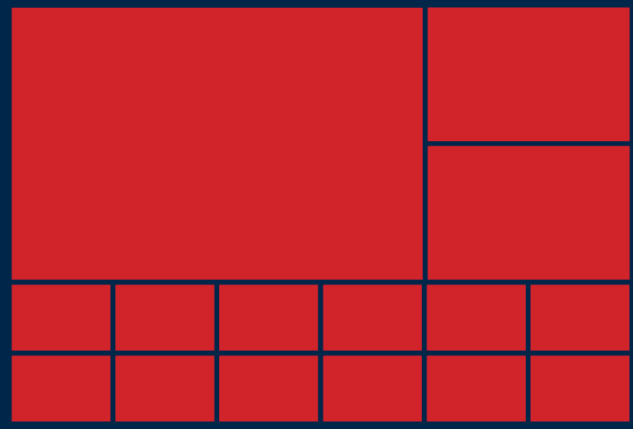

## HTML Assignment: Write HTML for the Mock ups

### Problem Statement

As you can see below, we have provided you with the images of two UI mock ups. One is a UI mock up of a site and another is a mock up for the table.

 

Write the HTML structure for both the mock ups.

Placeholder images have been provided for the images you see in the first Mock up. Use one of them as logo.

### Sample Input

UI mock ups

### Sample Output

HTML Structure

### Constraints

- Avoid styling the HTML structure of the first mock up
- Style the table using the style tag to match with the mock up of the table (second mock up)
