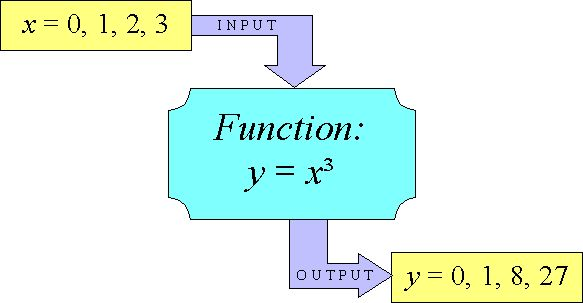

## Overview

This concept will help you understand Functions and Object-oriented programming in JS

## Learning Outcome

- What is a function?
- When and why should we use function?
- What is Object oriented programming (OOP) in JS?
- When should we opt for OOP?
- How does it help in structuring our data?


### Functions

A **function** is a block of code that performs an action or returns a value. Functions are custom code defined by programmers that are reusable, and can therefore make your programs more modular and efficient.



#### What you must do?

- Read about the [basics of JS Functions](https://javascript.info/function-basics)
- Read and understand [JS closures](https://javascriptissexy.com/understand-javascript-closures-with-ease/)
- Read about [callbacks inn depth](http://javascriptissexy.com/understand-javascript-callback-functions-and-use-them/)
- Do solve the corresponding assignments in the link.

### Object-oriented programming

Object Oriented Programming (OOP) refers to using self-contained pieces of code to develop applications. We call these self-contained pieces of code **objects**, better known as _Classes_ in most OOP programming languages and _Functions_ in JavaScript. We use objects as building blocks for our applications. Building applications with objects allows us to adopt some valuable techniques, namely, **Inheritance** (objects can inherit features from other objects), **Polymorphism** (objects can share the same interface—how they are accessed and used—while their underlying implementation of the interface may differ), and **Encapsulation** (each object is responsible for specific tasks). Objects and functions are useful for modelling our data and writing reusable code.


#### What you must do?

- Watch the [tutorial video](http://www.objectplayground.com/) to get a better insight of OOP

### Additional References

This section contains some additional helpful links.

- [Object basics](https://javascript.info/object-basics). You'll get an understanding of modelling data in key-value pairs, notations for accessing object values, how to loop through object data, etc.
- Read about [Object Prototypes](https://javascript.info/prototypes) which helps in extending objects to inherit properties and methods of other objects.


### Assessment Quiz

1. What would the dot notation help you with?
```js
var a = { number: 1, name: 'Rahul' };

console.log(a.name);  // Answer -> ?
```
- `Get property name`
- `Get value using the property name` [Correct Answer]
- `Get the reference ID of the value`
- `Dot notation is used with arrays and not objects`

2. Can we use the bracket notation [] to retrieve a Object value?
- `Yes` [Correct Answer]
- `No`

3. Given a number of elements that needs to stay in order, would you use an Object or an Array?
- `Object`
- `Array` [Correct Answer]

4. What are the keys in the object after running the code below?
```js
const artistsAndSongs = {
  'Prince': ["Purple Rain", "When Doves Cry"],
  'The Beatles': ["Revolution", "Norwegian Wood"],
  'Joni Mitchell': ["A Case of You", "Sunny Sunday"],
  'Justin Bieber': ["Baby"]
}

artistsAndSongs['Daft Punk'] = ["Harder, Better, Faster, Stronger"]

delete artistsAndSongs["Justin Bieber"];
```

- `['Prince', 'The Beatles', 'Joni Mitchell', 'Justin Bieber', 'Daft Punk']`
- `['Prince', 'The Beatles', 'Joni Mitchell', 'Justin Bieber']`
- `['Prince', 'The Beatles', 'Joni Mitchell']`
- `['Prince', 'The Beatles', 'Joni Mitchell', 'Daft Punk']` [Correct Answer]

5.  What does the following code print to the console?
```js
var mug = {
  capacity: "10 fluid ounces",
  customer_message: function (desired_size) {
    if (desired_size > 10) { return "This mug is not large enough for you" };
  }
}

console.log(customer_message(13));
```
- `ReferenceError`   [Correct Answer]
- `This mug is not large enough for you`
- `10 fluid ounces`
-  `Prints nothing`
