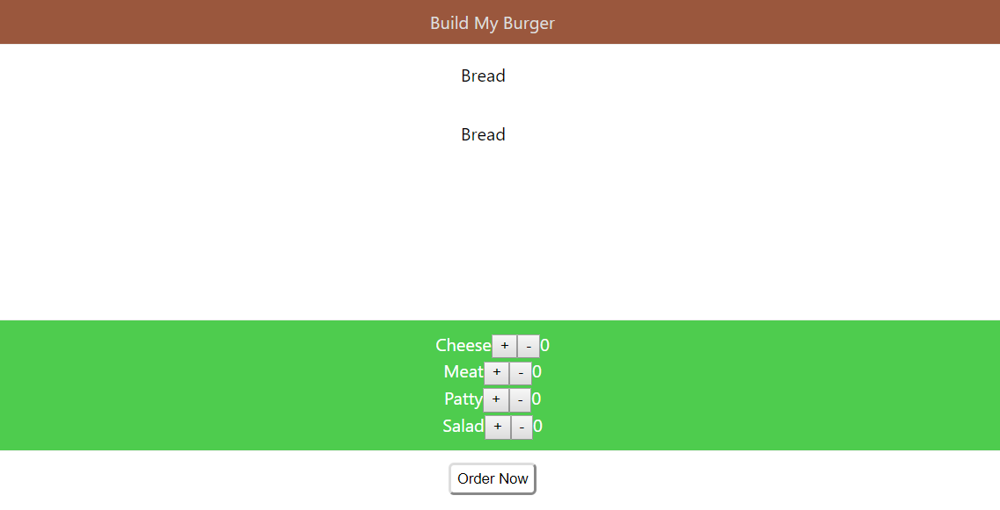

# Sprint 4: Foundations of ReactJS

## Overview

The previous sprint introduced you to the world of JS programming which promises reusable components, simplified coding and unbelievable rendering performances. In this sprint, we will deep-dive into Web development methodologies and ReactJS. 

We will understand how exactly does ReactJS simplify the life of front-end developers 

## Pre requisites
 
 React is a purely front-end development framework, it’s absolutely essential for you to ensure that the following pre-requisites are ensured.

-	HTML + CSS fundamental knowledge is absolutely essential. If you need to revise the concepts again, revisit Sprint 1 for HTML and CSS basics.

-	You don’t need to be a JavaScript expert to excel in this course! However, basic fundamental knowledge of JavaScript is absolutely crucial to begin this course. If you need to brush up your JS skills again, revisit Sprint 3 for foundations of JavaScript.

-	ES6 + JS knowledge is highly beneficial, but not a must-have. If you need to run through the ES6 basics, pay more attention to ES6 basics, arrow functions, let and const, and import-export modules of Sprint 3 – Foundations of JavaScript.

## Learning Outcomes

After this sprint, you will have an understanding of

- Entire Web Development Life Cycle

- What are JS libraries and frameworks? Why use them?
- Why React?
- Foundations of ReactJS
- Deploying web apps on the world wide web

At the end of this sprint, you will be able to build powerful, fast, user-friendly and reactive web apps. 

## What will you be building?

- Personal Profile Page

In order to get you more familiar with the ‘React’ way of coding, we will revisit the personal profile page you created in Sprint 0 and recreate it entirely using React.

---

- 'My Burger' Project

It's features will include:
1. Choosing the ingredients

2. Placing an order

|Order View 1|Order View 2|
|---|---|
|||

---

- Sprint Project: Financial Portfolio Tracker

By the end of the sprint, you should be able to build a Finance Portfolio Tracker with the following functionalities:

- Adding a stock(from the given list of companies)

- Viewing your stocks compared to the current price(Fetched by an API)

## Projects for further practice
• https://github.com/ahfarmer/calculator

• http://react-clock-basic.drminnaar.me/

• https://dev.to/drminnaar/11-react-examples-2e6d
 

 
